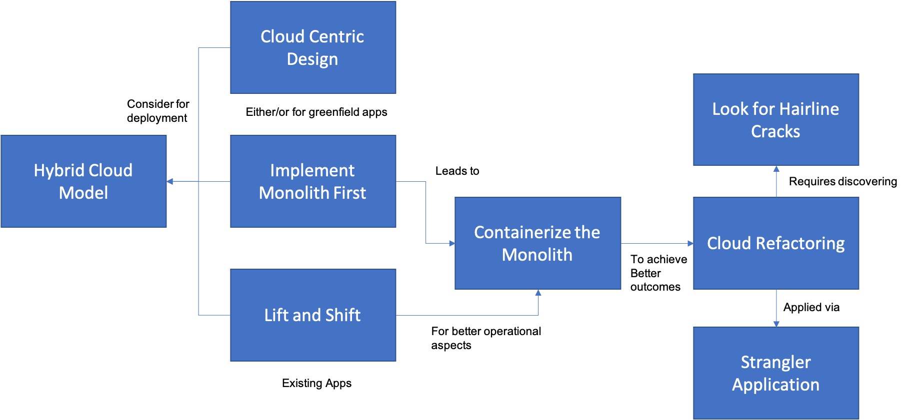

# Cloud Adoption

This part of our pattern language contains patterns that help guide the strategy for cloud adoption. This includes addressing questions on how to move to the cloud.  This is influenced by a number of factors--greenfield projects have an easier time than legacy software--and the patterns on cloud adoption should prove useful in selecting what strategy to use in what context.

+ [Cloud Centric Design](Cloud-Centric-Design.md) should be the starting point for new greenfield projects.
+ [Implement Monolith First](Implement-Monolith-First.md) is the right approach for many, perhaps most, new projects rather than going directly to microservices. 
+ [Lift and Shift](Lift-and-Shift.md) is the way to quickly move applications onto VM's in the cloud with minimal changes.  It's a good way to start a cloud journey, but it shouldn't be the end of the journey.
+ [Hybrid Cloud Model](Hybrid-Cloud-Model.md) is something that teams should consider when applying any of the above patterns, as it enables teams to choose the right environment for any application.
+ [Containerize The Monolith](Containerize-The-Monolith.md) is another option for getting started in the Cloud that sets you up for later refactoring.  It's a good "half-step" onto the road toward Cloud Native.
+ [Cloud Refactoring](Cloud-Refactoring.md) is where you begin for existing applications that need to take advantage of Cloud capabilities.
+ [Hairline Crack](Hairline-Cracks.md) shows where to look for places to begin the Cloud Refactoring process of a monolith.
+ [Strangler Application](Strangler-App.md) is the way to perform Cloud Refactoring incrementally while still keeping the application running  

