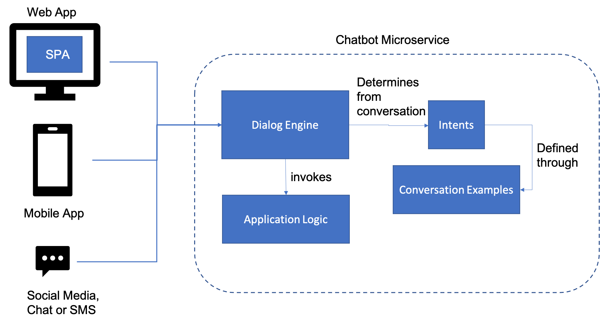

# Chatbot

You are building applications that will be used by a variety of users, including those who prefer to interface through platforms such as Text (SMS), or various social media chat platforms. This is related to the fact that most of your customers use a Mobile device as their primary means of accessing your application functionality, and these chat platforms are where your users spend the majority of their time.  Unfortunately, which platform predominates depends on location, culture, and a variety of other reasons that lead to a proliferation of platforms if you want to have reach across geographies, ages and other demographic factors.

**How do you both provide an optimized user experience and bring your application functionality to these customers on a variety of different social media platforms?**

In many types of applications, such as customer support, it is often hard to build a web site or application that naturally allows people to go directly to the specific piece of information that they need. Users resist navigating deep hierarchies of static pages, and FAQs become unwieldly when there are more than a few dozen entries.  Search tools like Google can alleviate this somewhat, but that depends on both the information developer and the user seeing eye-to-eye about the phrasing of keywords and other aspects of search engine optimization.  Instead, what often happens is that people look for help when they are stuck on social media sites; this could be something like Facebook or Twitter, or perhaps a more specialized site like LinkedIn.  The key here is that humans trust other humans to give them advice - often more so than they would trust the very same information if it were found on a website. 

What is needed is some way to meet these users where they are - to give them an interaction that either feels like interacting with a human, or that may be actually interacting with a human, intermediated through a program that may first organize the category of help and other prerequisites that a human needs to solve their problem efficiently. 

Therefore,

Build a chatbot as a microservice that can be plugged into different web sites, mobile applications and social media platforms.
Chatbots are not a new form of technology - in a sense they can be traced back all the way to the Eliza program written by Joseph Weizenbaum in 1966. However, recent improvements in Natural Language Processing has made it easier and more efficient to build them than before.  Most chatbots share a common set of architectural features that allow them to be built easily from existing open-source libraries or commercial web-based API’s.  Therefore, they can be implemented as microservices that can be called from within mobile apps, web apps, chat applications (such as slack or discord) and social media platforms.  An example of a typical Chatbot architecture is shown below:

 
For instance, for simple cases, the open-source [Chatterbot library](https://chatterbot.readthedocs.io/en/stable/) is a machine-learning based conversational dialog engine for Python.  It allows you to build or customize logic adaptors that take in preprocessed statements from the user and either provide you the best match to a response, or invoke other adaptors for more specific domain types (like date/time or math).  The system learns from a set of provided example statements in order to determine the best response.

The system that brought Chatbots back into common use, and still one of the most sophisticated, was the [IBM Watson](https://www.ibm.com/cloud/watson-natural-language-understanding) natural language engine, derived from the research system that won the game show Jeopardy! against top human competitors in 2011.  This has now evolved into the [Watson Assistant](https://www.ibm.com/cloud/watson-natural-language-understanding) suite of services, that work from a set of provided Intents (which are goals learned from multiple examples) in order to understand how to respond to a particular statement.  Likewise in Watson, you can define specific Entities that are found in the conversation, and even specify a conversational flow for a complex interaction that includes slots to hold the different entities you identify (such as the time for a dinner reservation).  Actions are the tasks that the system undertakes on a users behalf (such as searching for information as in what time tables are open at the restaurant). 

Somewhere in between the two ends is the [Amazon Lex](https://aws.amazon.com/lex/) service, which is connected to the suite of services that includes the Alexa voice service.  It also allows you to define Bots built up from Intents derived from samples, but fulfills each matched intent with a custom function built on AWS Lambda.

An important consideration in building a Chatbot is that you have to consider that it is a user interface channel into an Enterprise application much like any other user interface choice.  That means you have to plan for connecting requests from your chatbot into the back-end API's that your system presents, although due to the coversational nature of the interaction, these API's often end up being heavily mediated to strip down large amounts of data into smaller answers more uniquely suited to the nature of chat.  That means that patterns like [Backend for Frontend](../Microservices/Backend-For-Frontend.md) become even more important as you consider chatbots as part of a front-end architecture.    
