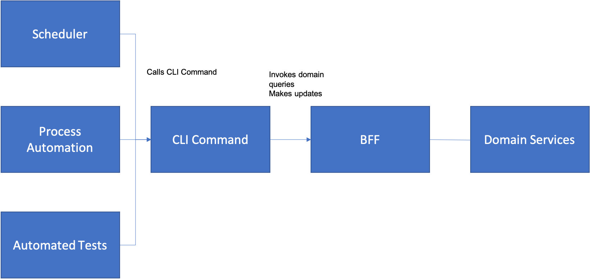

# Command Line Interface

You are building an application following a Multimodal Architecture, and your application may need to be used in a repeated or automated way – e.g. you may want to repeat an operation on a schedule, or repeat an operation many times, such as over a set of inputs.  

**How do you plan for automation of the services in your system?  How can you make it easy to automate activities like bulk loads, bulk changes, or scheduled execution of activities?**

Let’s face it, when most of us think about the user interface of a system, the most common interpretation of what the term “user interface” means brings to mind a graphical user interface of some sort.  Since the advent of the WIMP (Windows, Icons, Mice, Pointers) paradigm in the 1980’s and early 1990’s, it’s hard to conceive of any other way to interact with a computing system.  In fact, two entire generations of developers have grown up in which this is may be the only way in which they have ever interacted with computers.  

However, there are times in which a WIMP approach, be it on the Web, or in a mobile or desktop application has its limitations.  The simplest case of this is when a procedure needs to be automated.  Let’s says that you have a simple Web page that shows you how many people are registered for an event, such as a Meetup or a book club.  If no one registers for a particular event, you will still be charged for the event venue, even if no one shows up.  It would be great if you could look at the event signup just prior to the cutoff time, see if anyone is registered, and if not, cancel the event. 

If you have only a Native Mobile Application or Web Application, then unless the developer adds this functionality to the application, you are out of luck.  You might be lucky and the developer may have provided you with an API to the application, but that is not guaranteed, since Web Facing API’s present their own challenges to the application developer, nor is it necessarily something that would make it easy for you to write your simple check and cancel action. 

What we need is something that facilitates these simple types of automation tasks, yet at the same time, doesn’t require the complexity of programming to an API. 

Therefore,

**Build a Command Line Interface (CLI) for your system that allows you to execute APIs at the operating system command line.**

A *Command Line Interface* will be built up out of individual CLI Commands that each correspond to the major functions of your application.  If you build a *Command Line Interface* to your application, then it allows you to invoke functionality in several ways; from scripts, from unit testing tools, or through an automated platform such as a Robotic Process Automation tool.

A key element of a good *Command Line Interface* is composition.  This is a great way to facilitate the *Pipes and Filters Architecture.*  The *Pipes and Filters Architecture* is a classical way to implement an extensible architecture, as described in [POSA](https://www.amazon.com/Pattern-Oriented-Software-Architecture-System-Patterns/dp/0471958697).  In that approach, as exemplified by Unix pipes and filters at the command line, the output of one *Command Line Interface* command can be piped into the input of another command, allowing for composition of multiple tools.  In any case, each CLI command (composable or not) serves as a point of connection between the backend business logic (the BFF) and the scripting code that calls it.  This is shown in below.
 

Perhaps the simplest implementation of a CLI (perhaps a degenerate case) would be to implement an API on to your server-side application, and then use CURL (or another equivalent tool) to invoke the REST endpoints in place of a more specifically implemented CLI.  However, that’s not a great solution to the problem in that the parameters required to run CURL in this way would be quite complex – CURL just moves the parameters of the HTTP request into the command line, so while you make it possible to script or automate different combinations, it does not make it easy to do so.

Going back to our simple hypothetical Meetup example, we can easily imagine that there could be two commands, one equivalent to “Get Event Registration Details” and another one equivalent to “Cancel Event”.  They could be tied together with a simple shell script in Linux which could then be scheduled to run every night by using a tool like CRON.  However, this is not the only program that could be easily written using a CLI.  With a little bit of an extension of the CLI (to include creating events) you could imagine an application to look for open dates and times for events at the venue, and then to schedule events at those times.  The possibilities become quite expansive when you think about the compositional options. 

However, there are requirements on the CLI to make this kind of scripting feasible.  The *Pipes and Filters* pattern discusses that a common data format needs to be in place among the different commands in the CLI to facilitate piping output of one command into input of another.  There also need to be facilities for managing identity of the user of the CLI integrated as part of the command set in order to manage access to the back-end services that the CLI will need to call. 

One factor worth considering is thinking about the order of development of the different patterns in this section if you are building user interactions for a complex business process.  What we have found is that in many cases, the appropriate order of development should be API, followed by CLI and then GUI.  This is because the most important thing to do is to develop the back-end services that make up your business logic (e.g. the API).  However, once you have done that, then the question of understanding and facilitating end-to-end testing of that API often becomes the most difficult issue.  Writing a web based or mobile user interface and then testing that user interface with a tool like Selenium is possible, but often challenging.

Instead, if you begin by building a simple CLI that embeds the most important commands, you can use that together with simple scripting tools (such as Shell) to try out different combinations of the API’s.  This will often expose integration issues that would otherwise be difficult to identify and fix when also facing the added complexity of UI testing. Once the basic flows have been built and tested, then you can move on to building the user interface, but this always allow you to have the scripting alternative for more complex interaction combinations.

* * *

Dynamic Hook Points [Acherkan] can be used as a way to override behavior at the common API points. This is especially useful when you are using pipes and filters and want to provide a place to override behavior (hook points) as various points in the process.

An added benefit of a *Command Line Interface* is that it makes it easier to test things quickly manually while also facilitating automated testing. Commands can also serve as simple event triggers in an Event Driven Architecture (EDA).  In fact, you might even consider an Event Driven Architecture to be an alternative to a *Command Line Interface*, but the problem with this view is that while an EDA solves the problem of hooking into different stages of the business process easily, you are still completely locked into the event system as the only means of expansion or automation – which may or may not be what you want.
