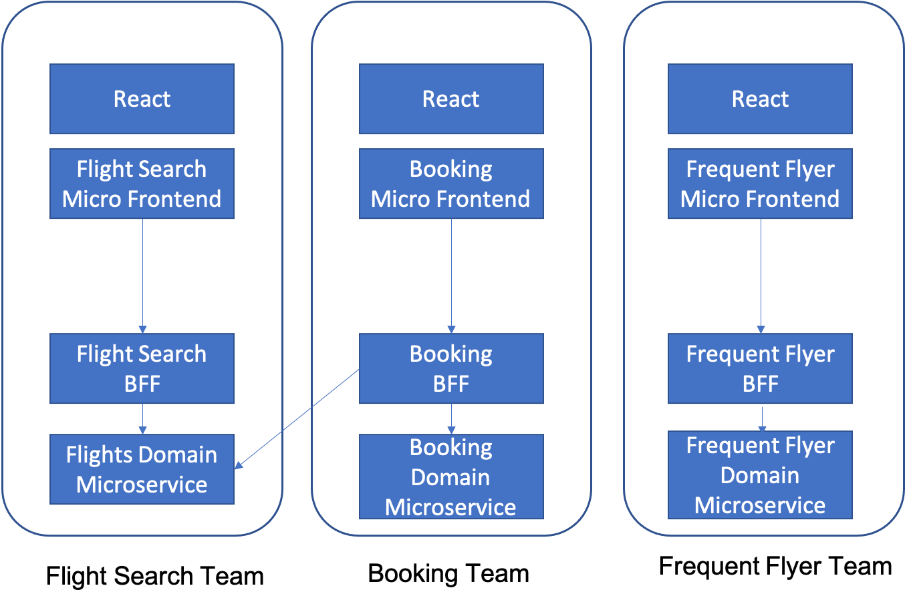

# Micro Frontend

You are developing a new web application or you are refactoring a section of a web application to make it more modern.  You realize that the temptation exists to place unrelated functionality for several business processes together in the same [Single Page Application](Single-Page-Application.md), even though that “feels” contrary to the microservices approach.  You are already applying a microservices architecture to divide up your domain into separate services.

**How do you avoid creating a monolithic Single Page Application by placing too much functionality in a common front-end?**

Just as the desire to separate concerns and avoid placing business logic that need not go together into a monolith led to the microservices approach, the same type of concerns apply to front-end UI presentation and logic written in HTML, CSS and JavaScript as well.  In particular:

-	You want to allow teams to be able to independently develop and release end-user functionality without having to retest or redeploy the entire UI
-	You want to allow cross functional teams that own a feature from front-end to back-end.
-	You want to allow teams to have the freedom to choose from multiple frameworks (such as Angular or React) when appropriate.

While the *Single Page Application* approach is fantastic in that it allows teams to entirely replace the UI layout and controls within a particular screen region at any time, when a team building a large application tries to apply that approach to many different areas of the business, the result can often be delays and unexpected conflicts as different aspects of the business may need slightly different UI representations.  For instance, the optimal screen layout in an airline web site for choosing a flight may not be the optimal layout for viewing your frequent flyer status.   What’s more, you want to allow for different customizations in different parts of your application; The payment flow of your airline website may be different, for instance if the customer is paying with airline points (and started in the loyalty section of the application) than if they are paying by credit card.

Therefore,

**Split your Single Page Application into several Micro Frontends that align to specific business features.  Allow the team responsible for that business feature to implement the full flow of the front-end for the feature.**

A *Micro Frontend*, is a *Single Page Application* which consists of HTML, CSS and JavaScript.  Each *Micro Frontend* has its own main container region and is loaded in a single HTML upload. Like both microservices and other *Single Page Applications*, a *Micro Frontend* should be an independent, self-contained application that has no dependencies on other *Micro Frontends* or shared libraries. For example, a change to a JavaScript library or CSS in one Micro Frontend should have little or no impact on any other *Micro Frontend*.

This level of isolation allows several *Micro Frontends* to be placed on a single web page that can operate independent of each other, be deployed independently and even use different frameworks, for example two different *Micro Frontends* on the same page could use Angular and React respectively.  In order to make this function, you will often have to use a Micro Frontend framework like single-spa, which is a router that allows the different frameworks to communicate.

However, this can result in of the downsides of the *Micro Frontend* approach in practice.  While teams have the flexibility to choose any MV*  framework they choose, and also to specify their own look and feel choices through CSS, this freedom can lead to inconsistency in the UI as you move from view to view.  Instead, we have often found it to be better if teams in an enterprise are consistent with the use of a single MV* framework, or at most a very small set of them, and that they also should share some common CSS files to specify a consistent look and feel for the entire web application.  Note that it is an anti-pattern to have a separate team define that common set of styles and CSS files – this is actually a better application of a loose “guild” approach to ensure that your UX designers and HTML developers are working together toward common goals.

To allow the team to own features and functionality from Frontend to Backend then the *Micro Frontends* should be aligned to the backend microservices -- especially those microservices that implement the [Backends for Frontends](../Microservices/Backend-For-Frontend.md) pattern.  The best way to do this is not to separate these teams, but to keep development of an end-to-end feature together as a single Stream Team. 

An example of an architecture (and team organization) that follows this pattern is shown below:
 

In this example, a team building a customer website for an airline is divided into three Stream Teams, each one responsible for one major epic that represents a major chunk of functionality in the application.  Each Stream Team is responsible for both the front-end and back-end development of their epics, although teams may connect at the microservices level, such as the booking team needing to be able to find flight availability if a flight is cancelled and must be rebooked.

By implementing the *Micro Frontend* pattern you can develop and deploy small features with more agility than in a monolithic Single Page Application This enables cross functional teams, ownership of frameworks, end to end ownership of features and reduces complexity.

You can read more about *Micro Frontends* in the [article](https://micro-frontends.org) that originally introduced them to the world.
