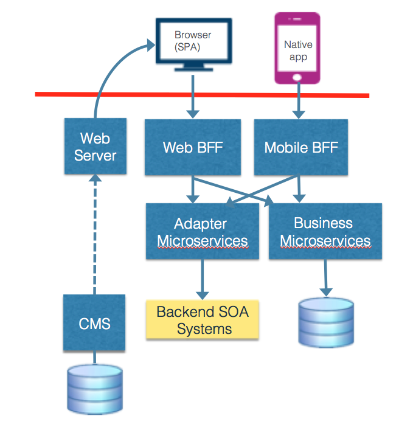

# Modern Web Architecture

You are building a new application or refactoring an existing application that needs to provide a rich user interface that can be
usable on many different devices such as smartphones, tablets, or laptops.

While the dynamic page approach is perhaps the most common application style on the Web, dating back to technologies like Active Server Pages (ASP), Java Server Pages (JSP), and PHP, the major drawback of this style is that the page-at-a-time semantics of these systems limit the type of interfaces that can be effectively developed with them. It is difficult if not impossible to write highly interactive user interfaces that take advantage of the user interface capabilities of mobile devices, tablets and touchscreens using only the capabilities of HTML.

**How do you design an application that meets the needs of your users while still working within the capabilities of the different interface devices that now exist?**

Your application design process is complicated by the following issues:

-   Web developers can take advantage of the capabilities of the Javascript engines built into modern web browsers.

-   Modern Devices have more user-interaction capabilities than previous generations of devices that only supported mice and keyboards

-   Users expect more from their applications and websites today than they did when the web was first introduced.

Therefore,

**Adopt a *Modern Web Architecture* that combines intelligent front-end components with general-purpose back-end components.**

A picture of this type of architecture is shown below.

You can build intelligent front-ends either as [Native Mobile Applications](Native-Mobile-Application.md) or [Single Page Applications](Single-Page-Application.md) that interface with more general-purpose back-end services representing the resources within a business domain, e.g. [Business Microservices](../Microservices/Business-Microservice.md). You can also use technologies like [Chatbots](Chatbot.md) for specialized user interaction types like customer support. You very often will want to use [Backends for Frontends](../Microservices/Backend-For-Frontend.md) where needed to adapt between the needs of specific Native Mobile Applications, SPA’s and Business microservices. [Near Caches](Near-Cache.md) can improve the performance of your intelligent front-ends.
