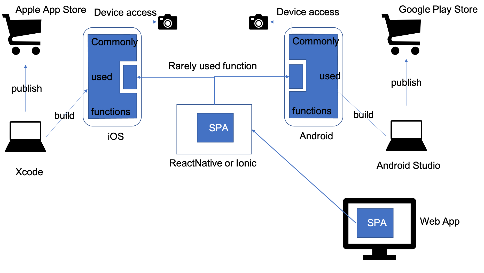

Native Mobile Application
===

You are building applications that need to be easy to use for a wide range of users and situations. Many of your customers are going to use a mobile device as their preferred means of accessing your application.

**How do you provide the most optimized user experience on a mobile device and take advantage of the features that make mobile computing unique?**

A user interface that is a [Single Page Application](Single-Page-Application.md) that runs well in the browser on a desktop or laptop computer might seem sufficient for a mobile device too. After all, mobile devices also have browsers, and this way the SPA can be reused on multiple devices. Yet an SPA that works well dynamically updating in a laptop browser that has a mouse, keyboard, and a large screen may be difficult to use on a mobile device.

There are several aspects of building mobile applications that are fundamentally different from building web applications (either traditional web apps or SPAs):

-	Smaller, more varied screens: Mobile device screens are smaller and vary in size more from phones to tablets, and often a large part of the screen is obscured by the virtual keyboard. The amount of content and detail that may fit well on a laptop screen is often too much for a mobile screen. The amount and layout of the content needs to adjust to the size of the screen and whether a widget like a keyboard or an enumerated list of choices is being displayed.
-	Human-machine interaction: Browsers can support interaction conventions that mobile screens typically do not, such as popup menus and multiple tabs or windows.
-	Input: A touchscreen with a virtual keyboard works differently than a physical keyboard and mouse. Scrolling and selecting may be more difficult and typing long strings of words can be tedious. Touchscreens often provide unique features like haptic feedback that are not part of the web computing experience.
-	Sensors and integrated features: Mobile devices have many attached sensors and include capabilities that users become accustomed to using in a variety of ways. These can include cameras for scanning QR codes and taking pictures of checks, GPS for precise locations, integrated calendars, and notification systems.
-	Platform evolution: The two major Mobile ecosystems change rapidly. Applications that emulate a mobile device’s look and feel often seem outdated when the native user interface libraries of the Mobile OS changes.  
-	Unreliable networks: Mobile networks can be slow and spotty. SPA’s use AJAX, which is specifically designed to be very chatty and assumes a fast, reliable network. A mobile client’s connection to the server needs to be less chatty and transfer less data to consume less bandwidth.
-	Local caching: A mobile client can cache state locally so that it connects to the server less often and may even be able to run disconnected, including in airplane mode.
-	Mobile home screen: A mobile device features a home screen that displays a catalog of programs it can run. The user of a browser-based application must remember to bookmark the webpage of the application. Failure to do so may make the browser-based application more difficult to find next time.

While *Single Page Applications* provide a user interface that can be adapted to different screen sizes and orientations—albeit often with a lot of scrolling— no browser-based application can take advantage of all the features and capabilities of a mobile device. What’s more, even though advances have been made in the speed and performance of JavaScript in many browsers, the performance of applications in mobile browsers is still noticeably worse than in laptop browsers.

Therefore,

**Write a Native Mobile Application, one for each of the two major platforms (iOS and Android), that enables users to interact with your application running directly on their mobile device without a web browser.**

A *Native Mobile Application* written using the tools and capabilities provide by the native development tool suite does not have many of the problems of an SPA running on a mobile device.  What’s more, there are several advantages to writing a *Native Mobile Application* instead of an SPA. A *Native Mobile Application* allows the developer to take maximum advantage of the platform’s capabilities. Users can easily locate and download the application through the platform’s application store and add it to the device’s home screen for easy access.  For most capabilities in a mobile application, this will be the past of least resistance, and will allow the easiest use of new device capabilities as they evolve.

However, a design choice that many teams building *Native Mobile Applications* often struggle with is how much of their entire application space to implement in the *Native Mobile Application*.  In a [Multimodal Architecture](Multimodal-Architecure.md), you often have more user functions in the web application than may be available in the Mobile application.  In particular, there is the question of how to allow access to seldom-used functions from within a *Native Mobile Application*. Sometimes, teams have used native functions such as Web views  to access the existing web content from within the Mobile application, but that often leaves users confused as the interface of the web application is not consistent with the native mobile application.  Instead, what has emerged as a solution to this problem is the use of frameworks such as React Native  and Ionic  that allow teams to embed application code written as *Single Page Applications* inside of existing iOS or Android applications.  The advantage of this approach is that React Native is compatible with existing web applications written using React, while likewise Ionic works with web applications written in React, Angular and Vue.  

An example of this kind of overall architectural approach is shown below:
 
 

* * *

Just as with *Single Page Applications*, microservices are a good match to *Native Mobile applications* since the business-oriented capabilities of a [Domain Microservice](../Microservices/Business-Microservice.md) map cleanly to the complex screen flow and interaction capabilities of a *Native Mobile Application*. *Native Mobile Applications* often are paired with [Backend for Frontends](../Microservices/Backend-For-Frontend.md) that can filter and translate results to data format that are specific to the Mobile platform.
