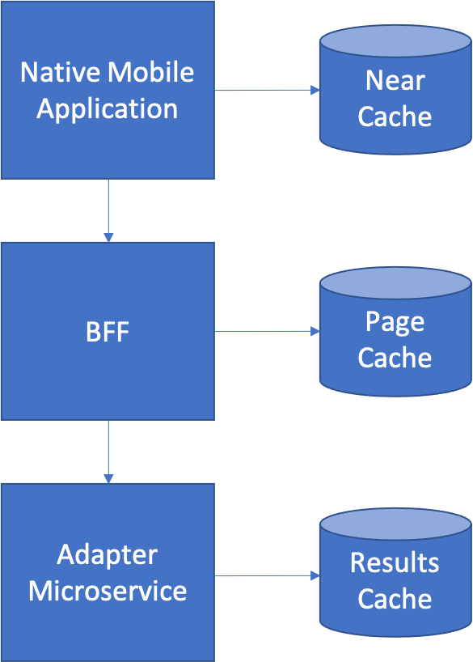

Near Cache
===

You are writing ea [Native Mobile Application](Native-Mobile-Application.md). The application must be able to operate efficiently even when Internet connectivity is not available at the highest speeds.

**How do you reduce the total number of calls to back-end microservices (particularly to [Backend for Frontends](../Microservices/Backend-For-Frontend.md)) for repeated information?**

-   You don’t want to cross the network any more than necessary, especially when network bandwidth is at a premium in a mobile device.

-   You don’t want to make the user wait any more than is absolutely necessary.

Therefore,

**Use a *Near Cache* located within the client implementation. Cache the results of calling the Backend for Frontend services so as to
reduce unnecessary round trips to the server.**

The simplest type of near cache is a globally scoped variable containing a hashtable data structure - something that is easily supported by JavaScript for Single Page Application or Java or Swift for Native Mobile Applications.  In iOS, Core Data or Property Lists can easily be used to store cached data locally. However, that’s not always the right solution – you may need more to store more complex data structures.  In this case, SQLite can be used on both iOS and Android as a fast, local structured data store.

The benefit of a *Near Cache* is that it reduces the total number of times you must call a [Backend for Frontend](../Microservices/Backend-For-Frontend.md) to retrieve repeated information. The drawback is that you must now manage the lifetime of the information in the cache to avoid it becoming stale, which can add complexity to your application code.

The position of all potential caches in this architecture is shown below.

