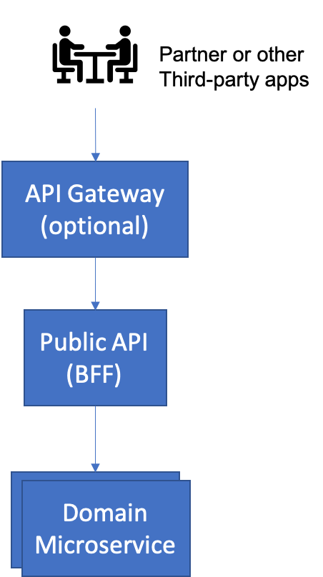

Public API
===

You are building an application following the [Microservices Architecture](../Microservices/Microservice-Architecture.md). However, although you may be providing your own user interface, in the form of a [Web Application](Web-Application.md), a [Native Mobile Application](Native-Mobile-Application.md) or even a [Chatbot](Chatbot.md), you also need to be able to enable third-party developers to use the services provided by your application.

**How do I best enable third party application developers to interact programmatically with my applications?**

A problem we have often encountered in Enterprises that need to work with third parties (business partners, governmental entities, etc.) is that they don't pay enough attention to the communication between what's inside their own walls and the entities. There are two extremes in which we have seen companies fail in their public API approach:

1.	The farthest end of the spectrum is assuming that you can simply publish your internal Microservices as APIs to the world. The result of this is that as these microservices change, that the changes are inflicted on the third parties outside of the company that depend on those API's. This results in teams often having to support multiple versions of API (we have seen up to six supported at once!) because the third parties cannot change their code as fast as the internal development teams.
2.	The other end of the spectrum is that the API's never change, resulting in lots of work, and lost opportunities inside the company itself. For instance, many retailing companies still practice FTP file exchange with their suppliers for catalog entries, making it difficult to update catalog entries in real time, and forcing teams to write batch jobs to do daily or even weekly bulk updates. As manufacturers become better at tailoring products for small market segments, this becomes untenable - especially as the number of products increases dramatically.

Neither end will work - both ends put an undue burden on one or the other partner, often both. What is needed is something that moderates the changes and isolates internal changes to some degree from the external API.

Therefore,

**Build a separate, externally facing, microservice that implements a Public API. The microservice is a specialized [Backend for Frontend](../Microservices/Backend-For-Frontend.md) that operates as a facade to internal services.**

*Public APIs* are sometimes subdivided yet again into Partner (closed) APIs and Public (open) APIs.  The difference between these two is that partner APIs are usually controlled through some contractual agreement and thus are more restricted in how fast they can change than a Public API.  In either case, you need to think about both subtypes as being products – they have consumers outside of your development organization, and you have to think about the impact of any changes on that external user community.

That is why the *Backend for Frontend* approach of creating unique Public APIs is so powerful – it allows you to isolate changes that affect your external user community (the Public API) from changes to your internal services.

Something that is important to understand is that a Public API is NOT the same thing as an *API Gateway*. The *API Gateway* pattern from [Richardson](https://microservices.io/patterns/apigateway.html) solves a slightly different problem caused by the creation of *Public API's* - that is that they should be discoverable, documented, versioned, and that access to them should be limited to those clients that are properly authenticated and have the right level of authorization. What has happened is that many API Gateway products also provide a form of the [Adapter Microservice](../Microservices/Adapter-Microservice.md) pattern as part of their implementation - thus people have often built the implementations of their Public API's directly into the API Gateway. This is limiting in several ways; first of all, it locks you in to that particular API Gateway vendor implementation, second, these products are often limited in how sophisticated the adaptation can be - resulting in Public APIs that often are barely disguised versions of internal microservices implementations. This is dangerous in that it exposes too much of your private implementation to the outside world, and second, it limits your ability to change your underlying implementation. Taking the architectural approach that a Public API should be its own, carefully designed entity on its own avoids this problem.

However, having said this, the *API Gateway* is an often-useful addition to the *Public API* pattern in that you can use these products to secure, manage and track your Public API usage. An example of an architecture that combines both can be seen below:
 

