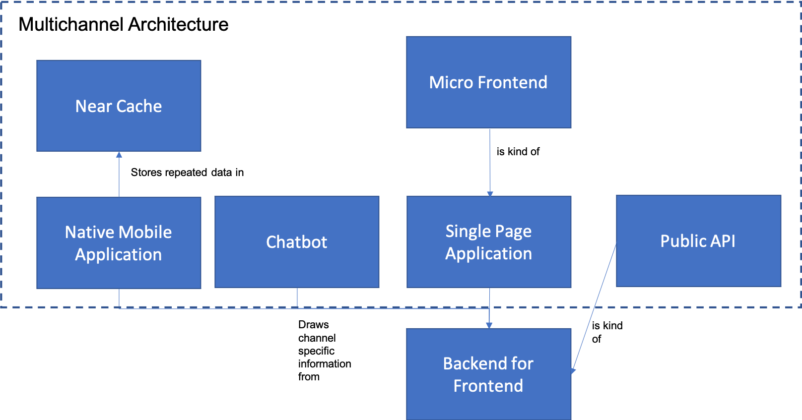

# Cloud Client Architecture Introduction

This set of patterns is built around developing a consistent client architecture that is compatible with a cloud-native application development style.  It may seem odd that we devote an entire chapter of this pattern language to front-end patterns that may not depend on the cloud at all, but there are several really good reaons for this that are worth discussing.

First and foremost is business value.  One of the hardest parts of a cloud adoption, and the part that most IT Teams fail at, is demonstrating real value to the business in tangible terms.  One of the easiest ways to demonstrate value to the business is by improving the User Experience of customers or associates in order to either produce more direct sales, shorten interactions and improve efficiency, or enable value-add services that increase revenue.  Most businesses have a long list of improvements to their User Experience that their product managers desire, but these are often hampered by issues below the user interface layer itself, which may include both technology and process issues.  Thus, demonstrating the value of cloud as part of a User Experience improvement often leads to positive outcomes in every respect.  What's more, it's often easier to either move or reimplement User Experience code on the cloud since it is already both close to the user (reducing latency) and relatively disentangled from back-end complexities.   As a result, most companies tend to start with client-facing applications as their first forays into cloud technologies.  

However, there is an even bigger, but more nuanced issue that companies have to consider when rebuilding or refactoring existing applications, and that is the cost of training teams on new front ends.  One of the most easily overlooked costs in adopting a new system is training cost, and the costs to the business of lost productivity when users have to become productive on a new system.  As a result, one of the things teams have to be cognizant of is the approach they take to segmenting a larger monolithic application into smaller pieces for refactoring.  Essentially, in a Minimum Viable Product approach, the word "Viable" becomes much more important when considering front-end refactoring and reimplementation.  In an article on the [Thoughtworks Blog](https://www.thoughtworks.com/insights/blog/part-2-problems-mvps-legacy-replacement
), Meaghan Waters points out three potential approaches that may be helpful:

* End User Segmentation is an approach that is useful when you have several disjoint (heterogenous) groups of users.  If you can focus on the Experience of a single User community at a time, then that gives you a potential way of segmenting a large monolithic application and moving it into the cloud as a series of smaller applications, each broken off from an original monolithic system.

* Process Segmentation is an approach that is useful when your users are more homogenous - in this case you look for boundaries of business processes and rewrite each individual business process.  Handoffs between users, even of the same general user group, are good indications of the boundaries of each process.  Likewise, if a process comes to completion or transitions to a new stage in a point in time, this is also a good place to break up a larger interface into smaller aspects.  

* Another option (that is less commonly found) is the "Competitive" segmentation approach, where you replace one existing system bit by bit with a new competitive system, perhaps for new customer acquisition while existing customers use the current system.  In this way, you can start new customers with a less complete system and let them gain more features over time.  

Any of the three segmentation approaches can work; which one you choose depends on your particular needs.  However, all three require you to build an architectural process framework for your front end refactoring that can extend to refactoring the back end business logic as well.  Even in this, you need to be careful. Any model that allows for the simultaneous refactoring of both front end and back end logic will require that you keep business logic separated from UI logic, with the assumption that business logic should be localized in the back end. In a [2021 Twitter thread](https://twitter.com/betsythemuffin/status/1385733763880034307), Betsy Haibel illustrates a particular trap that is easy to fall into:

“Web Frontends and their backends are logically one product.   You get a lot of feature requests that require changes to both.  When this happens developers have a choice.  They can build the feature “the right way” and put the business logic in the backend and go through the moderate pain of shipping both changes, or they can put it all in the frontend.  Over time, the weight of all these changes puts ever more business logic in the front end.”

Practically, what this means is that you should NEVER split a web front end (or in fact, any front end) and it associated back end logic across two teams.  Both should be built by a single [Stream Team](../Organization-Process/Stream-Team.md) that owns the saga that describes the feature as a whole.  This applies to all of the patterns that we are describing.  Teams should never be split vertically by role (front-end and back-end developer) but should instead be organized by feature split in any of the ways illustrated in the Waters article referenced above.  The patterns in this section are all intended to be applied within that organizational framework.

The patterns include:

+ [Multichannel Architecture](Multichannel-Architecture.md) is the root pattern of this section and describes the overall structure of client applications.  This structure is important because most modern applications are multi-channel; that is they have multiple types of User Experience that all must come together in a consistent user experience that may cross mobile applications, web applications, and chatbots. 
+ [Native Mobile Application](Native-Mobile-Application.md) describes the most common solution for most consumer-facing client applications.  While Web Applications are still enormously common, and are often the best solution for internal corporate applications, consumers now expect the bulk of their interactions with many companies to take place through a dedicated mobile application. 
+ [Chatbots](Chatbot.md) are a common and important user interface channel for specialized types of user interaction such as customer support.  Chatbots are almost never the sole means of user interaction with a client, but are an important supplement to other client interaction styles such as mobile applications or web sites.
+ [Single Page Application](Single-Page-Application.md) is the most common approach to building client-side web applications that fully use the power of modern browsers.  They leverage the full power of browser-based JavaScript, CSS and HTML to build highly interactive applications.
+ [Public API](Public-API.md) is the mechanism for making your application services available to the world of developers outside of your own team.  They are important wherever you have interactions with third parties such as suppliers, business partners or governmental entities.
+ [Micro Frontends](micro-frontends.md) are a  way to avoid recommitting the mistakes of Monoliths within a client-side application built using the Single Page Application architectural approach.
+ [Near Cache](Near-Cache.md) are useful particularly with Native Mobile Applications in reducing the number of calls that have to cross the network when data rates may be limited.

The relationships between the patterns in this section are shown below.

