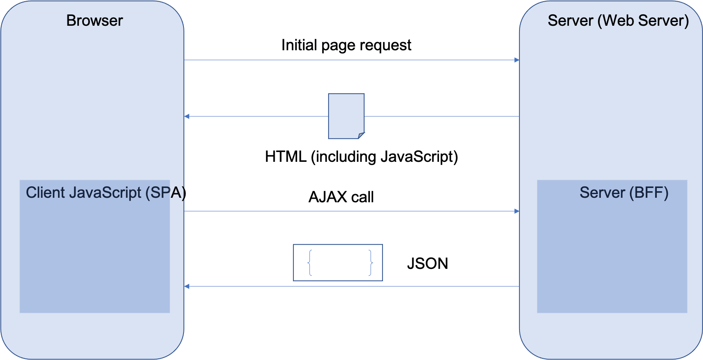

# Single Page Application

You are developing a new browser-based web application, or you are refactoring a section of a web application to make it more modern.  You need your application to be responsive and fast, and to feel as much as possible like a native application.  At the same time, you do not want to make your application become unusable when internet connectivity is spotty or slow.

**How do you design the front end of your application to take advantage of the capability of modern browsers and provide the best mix of client responsiveness and server optimization?**

You find the following things to be true when designing your front-end.

-   You want to provide the user with a very responsive application that they can interact with easily despite network lags.

-   You want the user to be able to interact with the application naturally, without arbitrary restrictions in user interface design.

-   You want to enable your designers to provide the cleanest, most attractive user interface possible, and to be able to make design modifications without requiring them to work through your development team.

-   You want to allow your application developers to focus on application development issues and not have to inordinately concern themselves with the minutiae of user interface component layout and design.

The “traditional” page-at-a-time approach of building web applications (dynamic page template technologies like ASP.NET or JSP) do not meet these conditions.  The page-at-a-time back and forth trips to the server make the applications slow, and at the same time require changes to both the front-end and back-end code at the same time since the back-end code is mixed inexorably together with the front-end HTML.

Therefore,

**Design your application as a *Single Page Application* using HTML5, CSS3 and JavaScript, which are natively implemented by the browser. Store page state within the client and connect to the backend through REST services. This approach is called the “Single Page Application” because all of the HTML, CSS and JavaScript code necessary for a complex set of business functions, which may represent multiple logical screens or pages, is retrieved as a single page request.**

The SPA approach is a variation on the traditional Model/View pattern used in the dynamic web approach in that Views are not complete web pages.  They are simply portions of the DOM that make up the viewable areas of the screen.   The initial HTML load is simply a shell that is broken up into child containers (or regions).  Developers often use a MV* framework, such as React, Angular, or Vue, to handle the difficult parts of the application management such as routing to the right view, combining data from AJAX calls with template HTML fragments, and managing the lifecycle of each View.

The main benefit of the Single Page Application approach is that it allows for very responsive, fast applications that render quickly. JavaScript code that executes within a web page can control not only the look and feel of the application by generating and manipulating the client-side DOM in any way it chooses, but can request information from the server at any point based on user interactions – resulting in more responsive user interfaces.  The overall flow of information in the SPA approach is shown below.

Another advantage of the approach shown above is that the AJAX calls that are issued by the SPA to the server have generally smaller payloads, and thus are faster to execute, than corresponding calls that would transmit a completely rendered HTML page. 

Single Page Applications often are written to take advantage of Responsive Design principles (see [Brown](https://www.amazon.com/Modern-Web-Development-WebSphere-Multi-Platform-dp-0133067033/dp/0133067033)) to optimize user experience for screen layout and size. CSS Media queries are often used to include specific blocks that only apply for specific screen types. This technique allows a different set of CSS rules to be specified for tablets, mobile phones or laptops, resulting in screens that are laid out and configured specifically for those devices.

In addition, the Single Page Application approach effectively decouples UI logic (particularly rendering and entry validation logic) from server logic – this makes it possible in many cases to make UI changes without having to update a corresponding server component.
Single Page Applications are most often built using a SPA framework like React, Angular or Vue.  All of these frameworks differ slightly from each other, but each implement the same basic pattern as described above.

In a complex business application you may implement several *Single Page Application* instances. Each one represents a single logical set of screen interactions that perform a business function. This approach maps extremely well into the microservices approach, as you can match an SPA to the capabilities of one or more [Domain Microservices](../Microservices/Business-Microservice.md). However, you may need to perform some translation or conversion of the results of a [Domain Microservice](../Microservices/Business-Microservice.md) in order to match the unique user interface requirements of your SPA.  That will naturally lead to the need for the [Backends for Frontends](../Microservices/Backend-For-Frontend.md) pattern.

Single-Page Architectures can sometimes, unfortunately, grow to the same size and complexity of the Monoliths they are expected to replace.  To avoid that, build complex application as a set of [Micro Frontends](micro-frontends.md)
