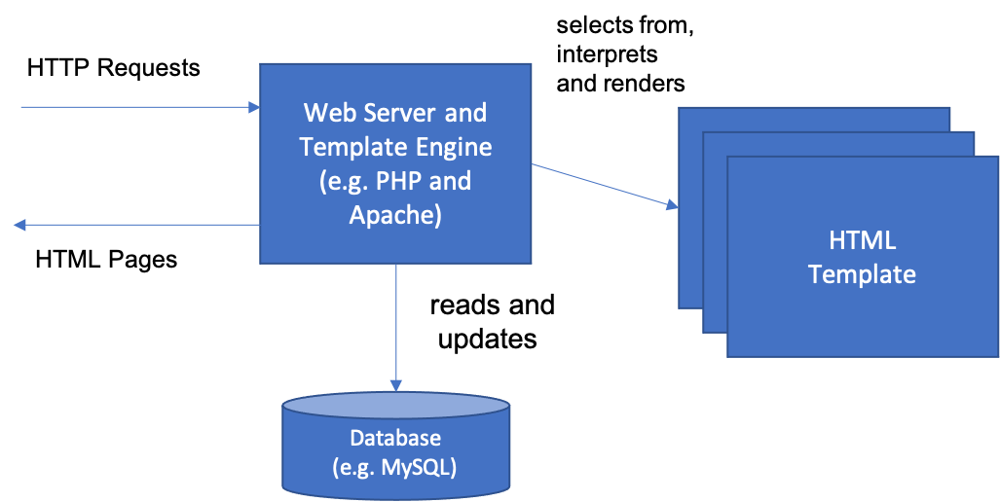
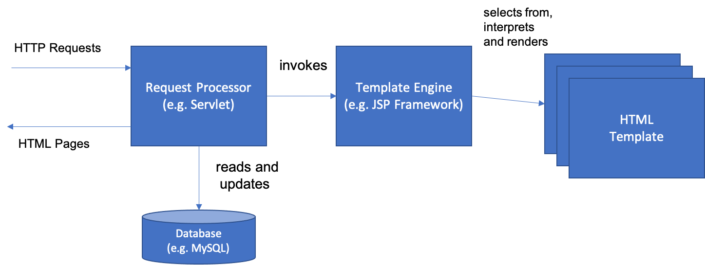
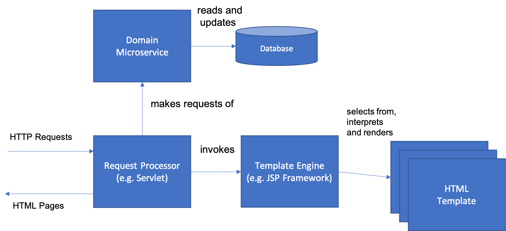

# Web Application

You are building an application that needs to reach the largest possible user community.  You know you want to follow a [Multimodal Architecture](Multimodal-Architecture.md), but at the same time you need to get something out quickly to your users.

**How do you build a user interface to provide basic functionality to the largest possible set of users with the minimum amount of effort?**

Some applications are meant for greatness.  Most, however, are not.  One of the downsides of taking all of your architectural and business lessons from unicorns and hyperscalers is that it is easy to believe that all applications will become virally successful, require unheard of scalability, and attract millions of adoring fans that hang on every font and icon change with baited breath.  The truth is, that while there are applications that fit that category (for instance, Twitter created a mini-storm by merely changing its font in August 2021 - see [Peters]), the reality is that much more than 90% of all applications written will be written for an unchanging audience, whose size is well-known ahead of time, and whose usage patterns are both consistent and sporadic.  For instance, how many times have you had to update your home address at your Auto Insurance company?  The total number of times that particular part of their website will be used in a year can be calculated very precisely from the size of their covered population and a coefficient derived some population movement statistics obtained from the Census Bureau.  

Even setting aside the fact that most Enterprise applications are much more like our hypothetical address-change app than Twitter or Facebook, there are other fundamental issues that make it often less advisable to try to keep up with the cutting edge of user interface technology.  Probably the most important, and least considered is developer skill – if you adopt a new front-end JavaScript framework then you are implicitly saying that it is worthwhile to spend the time for your developers to learn this framework – something that will make you even more likely to want to use it to its fullest extent once that learning time is committed.  What this leads to is an example of the sunk cost fallacy – if your developers spent time learning something, then you want to get the benefit out of that time, which will often result in applying technologies to problems for which they are, at best, overkill.

On the other hand, what if there were a set of technologies that were already well understood, widely available in commercial and open-source implementations, completely compatible with cloud-native principles, and what’s more, could give you the fastest path to value for many types of user interfaces?   That would seem to be a godsend to teams who struggle to learn all of the other parts of Cloud adoption.  And what if those same technologies allowed you to reach the widest possible user community at the same time?  In fact, that technology exists.

Therefore,

**Build a Web Application that serves up HTML pages from a server-side application and that takes input through HTML forms.  This works best for relatively small and simple applications, particularly those that do not absolutely require intense graphical interaction or that are used sporadically or rarely.**

A canonical example of this approach is PHP (a recursive acronym for PHP the Hypertext Processor).  PHP runs inside virtually any web server software and will work with most databases.  PHP programs are written inside of HTML pages where PHP statements are interpreted inside special tags that are differentiated from HTML tags, usually with the syntax <?php...?>.  Any PHP code inside the tag is dynamically interpreted and evaluated to render HTML that is then inserted into the appropriate place in the HTML page as it is returned to the page requestor by the web server.  This type of architecture is shown in below:
 

 One change that developers soon realized is that making the HTML template the target for requests made it very difficult for a choice to be made in your code on what page to render when an HTTP request is received.  That led to a separation of the request processor from the template engine.  This approach was commonly used in ASP.NET and Java Enterprise Edition, where the request processor such as a. Java Servlet was separated from the template, which was a Java Server Page or JSP. This is shown here:
 

Many of you reading this you may already be saying: “That’s what our old monolith was!  That’s what we’re trying to move AWAY from!”  You will note that we are merely describing the approach that this type of application takes in constructing user interfaces but did not say anything about how large or small each application would be.  The rejection of Web Applications as a technology is an unfortunate application of the principle of tarring two very different things with the same brush.  

We mentioned in the introduction to this chapter that one of the key principles in building user interfaces should be the separation of domain logic from user interface logic. One of the problems with the two architectures we have just shown is that there is no good way to enforce that separation.  In fact, the PHP architecture almost requires that the two be mixed together, and to avoid doing so in the Servlet architecture above takes great discipline in building application Façade objects that would act as adapters to the core of the application; something many teams never took up, instead coding business logic directly from the servlets or other request processors or (even worse) the JSP or ASPs themselves.

Instead, a better way to do this is to formally separate the two by introducing a separate Domain Microservice layer.  This version of the Web Application architecture is shown in below:

In this way, the three parts of a “Model View Controller” or “Model View Presenter” pattern are introduced .  The Request Processor handles the issues of control flow, the [Domain Microservice](../Microservices/Business-Microservice.md) handles domain logic, while the Template Engine handles building the HTML View. Building applications in this way can be a very fast path to a minimum viable product; as fast or even faster than building a [Single Page Application](Single-Page-Application.md) depending upon the complexity of the screen flow.  What’s more, building this kind of application is something that many developers already have skills in; Java programmers often learn Servlets and JSP’s first before learning frameworks for building REST services, and PHP skills are common in the industry as well.  The tools, frameworks, and runtimes for building this kind of application are very mature and stable, available as open source, and run both on premises and in every available container technology and cloud provider – meaning that developers will not be running on the bleeding edge of a new technology or locked into a particular vendor.  

A key principle to follow in sizing a *Web Application* is that each individual application should perform only one business function.  If this sounds like the same principle that applies to microservices, that’s because it is.  Not only will that make the business logic more cohesive, but it will keep the user interface logic simpler and more readable as well.  If you construct your application with template technologies like JSP, PHP or ASP and, importantly, keep the user interface small (fewer than ~20 pages per application) and directly reflective of the business process flow of the domain, then the issues that led to the problems we saw with large, monolithic *Web Applications* can be avoided. 

Whenever a business process (and screen flow) crosses from one Domain Entity or Aggregate to another, then you should also cross over to another application to handle that flow.  Thus, your web application boundaries should roughly correspond to the boundaries of a microservice.  Going beyond that can lead to grouping together unrelated logic and leads to building a monolith.  There also may be a temptation to build multiple *Web Applications* that all communicate through a shared database, which again should be avoided.  

If you find yourself moving in that direction, or if you have a user interface that is complex and not easy to express as simple forms and results pages, then you probably need a more capable client-side application based in JavaScript with backend logic provided by *Domain Microservices*.  In that case, a *Single Page Application* is the best option.   Of course, the ultimate in user interface customization is possible if you build a [Native Mobile Application](Native-Mobile-Application.md), so you also need to consider your options in that regard. 

* * *

This pattern is is related to *Template View* pattern from [POEAA](https://www.amazon.com/Patterns-Enterprise-Application-Architecture-Martin/dp/0321127420) and in fact may be considered a combination of *Template View* and *Application Controller*.  However, building a traditional web application is only one user interface choice of many that developers now face, so many of the reasons for separating the two are no longer necessarily applicable given this plethora of choices.  The *Web Application* pattern is the one of many such choices in POEAA that “won out” in the end in the market, even to find itself replaced by other technology options. 
