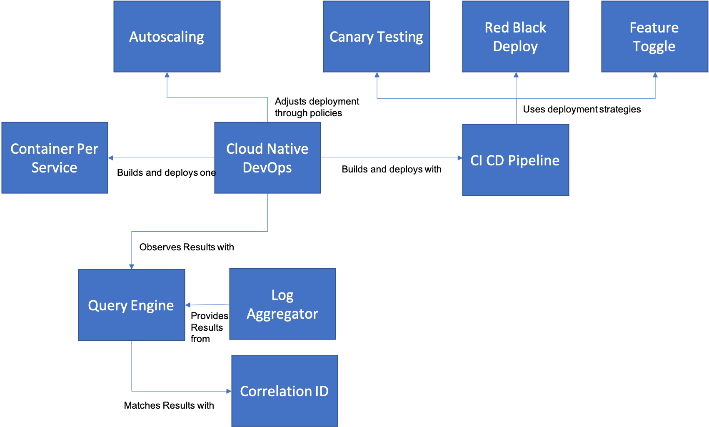
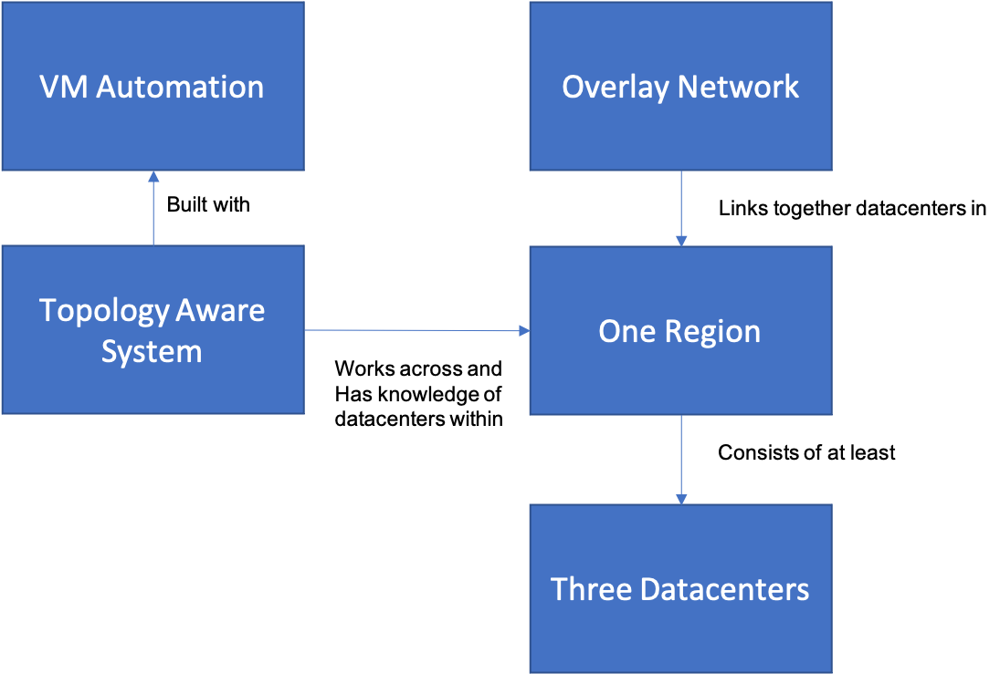

# Cloud Native DevOps Introduction

In this section of our pattern language, we address the major development and operational issues that come with adoption of the cloud.  It is naive to assume that a team can adopt cloud-native technologies without changing any of their development and operational processes.  That would be like putting a Jet Engine inside a Model-T Ford.  The way you manage and control your software must be adapted to the way in which your software will be built.

+ [Cloud Native DevOps](Cloud-Native-DevOps.md) is the root pattern for this section.  It shows how to bring together several required concepts for delivering microsevices-based applications.
+ [Container Per Service](Container-Per-Service.md) is the right level of distribution for most microservices-based applications.  It strikes a sweet spot between monoliths and fully distributed objects.
+ [CI CD Pipeline](CD-Pipeline.md) is the minimum level of automation required to perform Continuous Integration and Continuous Delivery of Microservices.
+ [Red-Black Deploy](Red-Black-Deploy.md) is the standard approach for doing services deployment in a distributed system (e.g. one hosted across more than one data center or with multiple hosts in a single datacenter) that allows you to deploy without service disruption.
+ [Canary Testing](Canary-Testing.md) allows you to roll out possibly disruptive changes in a controlled way to a small group of users.
+ [Feature Toggle](Feature-Toggle.md) provides you with a way in your code (although controlled by configuration) to dynamically roll new features into a production environment in a limited way.
+ [Autoscaling](Autoscale.md) is a way of taking advantage of cloud-provider or cloud-platform mechanisms to allow your application operations teams to keep from worrying about detailed issues of ongoing capacity management.

The relationships between this set of patterns are shown in the diagram below.

Likewise there are also considerations on how you conceive the overall deployment architecture of your system that impact the overall operational profile of your system.

+ [Automate VM Deployment](Automate-Deployment.md) is fundamentally required in order to make sure that you have a consistent approach to seting up the PaaS or container environment that your microservices will run within, in addition to any additional IaaS services that container environment may depend on.
+ [Three Data Centers](Three-Data-Centers.md) is the appropriate number of zones that you need to deploy a system across in order to reach the "sweet spot" of minimum cost and maximum reliability.
+ [One Region](One-Coast.md) is the minimum geographical distribution of datacenters for a redundant infrastructure.
+ [Overlay Network](Overlay-Network.md) is the best way to connect disparate datacenters together into a seamless cloud infrastructure.
+ [Topology Aware System](../Microservices/Topology-Aware-Application.md) is fundamental to being able to build resiliant applications in a distributed cloud model

The relationships between this set of patterns is shown below:

