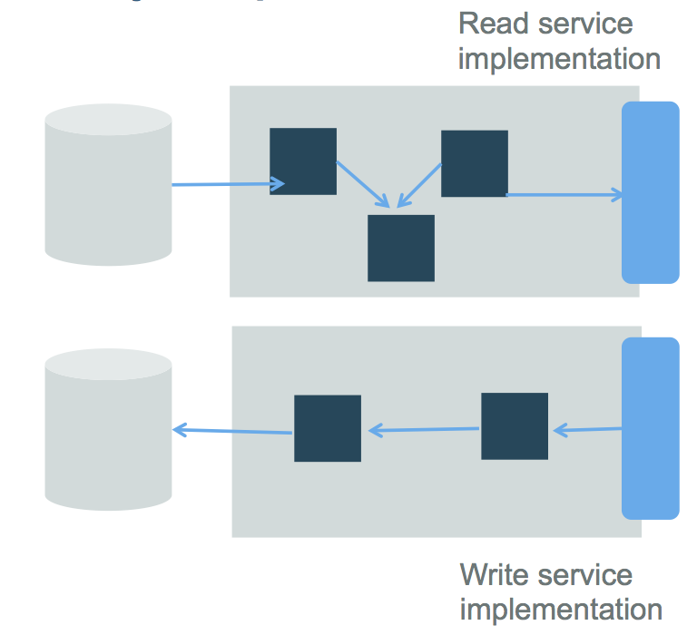
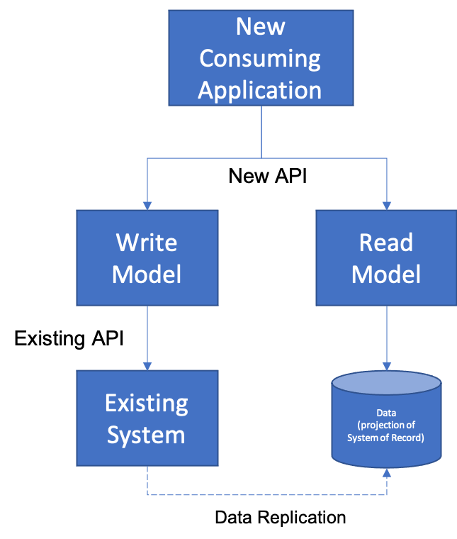
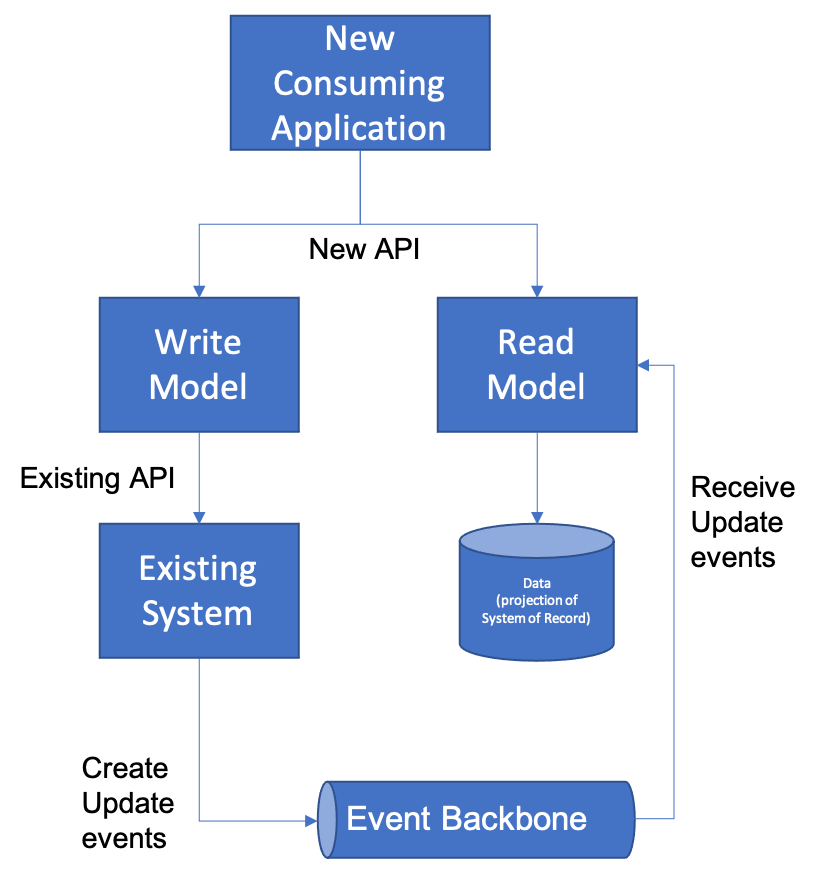

# Command Query Responsibility Separation

You are building an application that is following a [Microservices architecture](../Microservices/Microservices-Architecture.md).  The team is not operating in a complete greenfield - there are existing sources of functionality or data that must be reused in order to complete the application on time and within budget.  In particular, you cannot transition all at once to a Scaleable Store because critical data is stored in a large, monolithic database.

**How do you deal with the fact that you can't usually transition all at once between existing monolithic data stores and the database-per-microservice approach?**

The problem is that reading from data is different than writing data.  A service implementation usually has a specific "projection" of a set of relational data that represents a specific view of the data. That view can be usually cached using any of the data caching patterns described in this pattern language. The issue is that writing to the database often involves writing to multiple tables with complex business rules dictating how the information being written needs to be validated and updated. It's that latter code, often encoded in legacy applications, that is difficult to change.

Therefore,

**Use Command Query Responsibility Separation (CQRS) to provide different read models and write models to the same data allowing two different routes to allow you to write microservices as adapters to existing data while allowing you to change the responsiblity of data management over time.**

CQRS separates the "command" operations, used to update application state (also named the 'write model'), from the "query/read" operations (the 'read model'). Updates are done as state notification events (change of state), and are persisted in the event log/store. On the "read model" side, you have the option of persisting the state in different stores optimized for how other applications may query/read the data.  You see this in the diagram below:

One of the key aspects of CQRS is that when it is used for modernization purposes that it requires ta [Data Replication](Data-Replication.md) approach in order to keep the Read Model and the Write Model in synchronization.  Let's imagine that we have set up the following approach by combining existing patterns.  We have created a new Read Model that is a projection of a data set in an existing application by creating a brand new [Business Microservice](../Microservices/Business-Microservice.md). We have also created a new Write Model that is an [Adapter Microservice](../Microservices/Adapter-Microservice.md) that translates from the new API to the existing API of the old application. This will require us to set up some type of Data Replication between the two in order to have the projection of the existing data keep up with changes to the Write Model.

The most common way of setting up this Data Replication in this case would be by introducing an [Event Backbone](../Event-Based-Architecture/Event-Backbone.md) between the existing application and the microservice that is serving as the Read Model.  In this way, the new Read Model can subscribe to changes made to the existing system, and update its data accordingly. 

The update events can be created directly in the existing application (if you have the ability to modify the existing application) or if you do not, you can use a technology like Change Data Capture to record changes to the application's underlying database.  Many existing Change Data Capture tools such as [IBM Infosphere Change Data Capture](https://www.ibm.com/products/infosphere-data-replication) and [Oracle Goldengate](https://www.oracle.com/integration/goldengate/) support connecting to a Kafka Event Backbone directly, as do open source platforms like [Debezium](https://debezium.io/).

What's more, you can even take this farther.  By introducing [Event Sourcing](../Event-Based-Architecture/Event-Sourcing.md) you don't even necessarily need a database for your Read Model that represents the point-in-time representation of the Read Model.  Instead, we can simply recreate the current state by reading the event sequence either stored directly on the [Event Backbone](../Event-Based-Architecture/Event-Backbone.md) or in a longer-term archival event database.  

CQRS was introduced to most people in [this paper](https://martinfowler.com/bliki/CQRS.html)  
