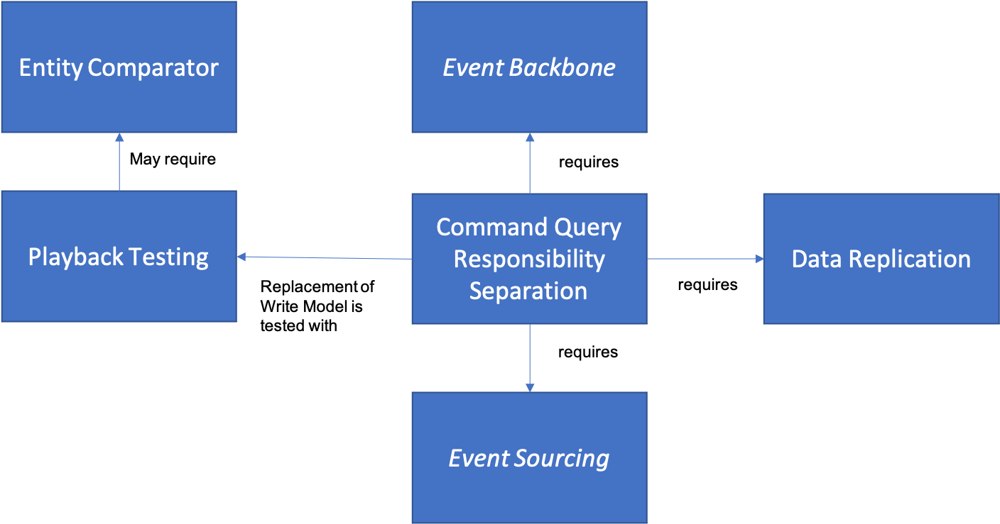

The major issue with adopting cloud is that in most Enterprises, the applications that most need to run on the cloud are not new.  Enterprises rarely get to build brand new "greenfield" applications. Instead, most applications are "brownfield" meaning that they were built for one set of purposes and under a particular set of assumptions.  Unfortunately, those were rarely the assumptions that apply on the cloud.

This set of patterns deals with the problem of how to deal with the realities of the refactoring process when you have to rewrite applications to work on the cloud, particularly when you are rebuilding them as microservices.  These are complements to other patterns in the pattern language as they only apply in specific cases where you are already applying other, more basic patterns from Cloud Native Architecture and Event Based Architecture.  In particular, they focus on the problem of how 

*  [Data Virtualization](Data-Virtualization.md) is often a good first step in that it "puts off" the refactoring of data and allows you to begin with refactoring code to microservices while keeping the underlying data representation the same.
*  [Command Query Responsibility Separation](Command-Query-Responsibility-Separation.md) is a basic pattern related to other patterns in an [Event Driven Architecture](../Event-Based-Architecture/Event-Driven-Architecture.md) that helps you to separate microservices into separate parts for Reading and Writing, which is an important aspect for microservices refactoring.
* [Data Replication](Data-Replication.md) is crucial for keeping the different databases (for the Read Model and Write Model) in CQRS in sync.
* [Playback Testing](Playback-Testing.md) is an approach that helps you with determining that you can complete the strangulation process for a microservice
* [Entity Comparator](Entity-Comparator.md) is needed in some cases to help you determine that Playback Testing is succeeding when the team has limited knowledge of the existing system being replaced.

The relationships between these patterns and the patterns they rely on is shown below:

