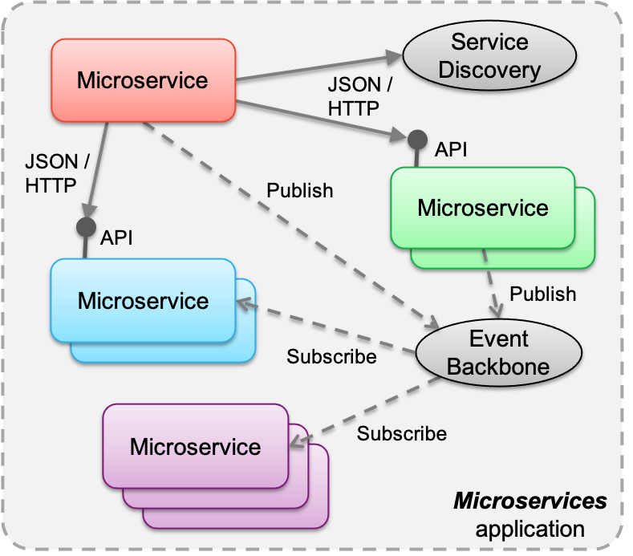

# Event Consumer

You are building a [Microservices Architecture](../Microservices/Microservices-Architecture.md) and you need to decouple one microservice from another

**How do you allow a microservice to find out when data belonging to another microservice changes?**

One of the strengths of the Microservices Architecture can at first appear to be its greatest weakness.  A key tenet of Microservices is that they are decoupled from each other and do not share data through a shared database.  However, there are many cases in microservices development when a microservice will need to know if the state of another microservice has changed in some specific way. 

For instance, if you are building an Airline system, the reservation microservice represents the combination of the fact that a person (a passenger) has booked a specific seat on a specific flight.  However, if that flight is cancelled, how does the reservation microservice discover that fact?  It could constantly query the flight microservice for its current status, but that would be both inefficient and potentially error-prone if the request is made over HTTP, which is notoriously unreliable.

Therefore,

**Declare your microservice as an Event Consumer that can listen in on a channel or topic that indicates that an event has occurred that it is interested in.  When the event occurs, the Event consumer will receive a notification of that event.**

Event consumers are the recipients of the diverse events they may have indicated a preference for. A sophisticated event driven architecture will cater to the existence of diverse types of consumer that are capable of receiving events of varying degrees of complexity, throughputs, technologies and technical  maturity.  Events that an EventConsumer listens to must travel over an [Event Backbone](Event-Backbone.md)

You can see how a Microservice can act as an Event Consumer in the diagram below:

One final aspect worth noting is that acting as an Event Consumer can solve one of the problems with the [Microservices Architecture](../Microservices/Microservices-Architecture.md).  If an application consists of several Business Microservices, each of which own their own data and have their own schema, then you will sometimes run into the problem where two Microservices: Microservice A, and Microservice B each own their own data - but then a requirement comes along later that needs you to represent the equivalent of a SQL JOIN of the data of A and B.  One way to solve that would be to allow the new "Join" Microservice (C) to access both databases, but that would be a violation of the Microservices Principles.  Instead, a better way to do that is to have "C" be an Event Consumer of both A and B, and for A and B to publish events whenever any of their data changes.  That way, C can own its own schema, and be independent of the data representations of both A and B. 
