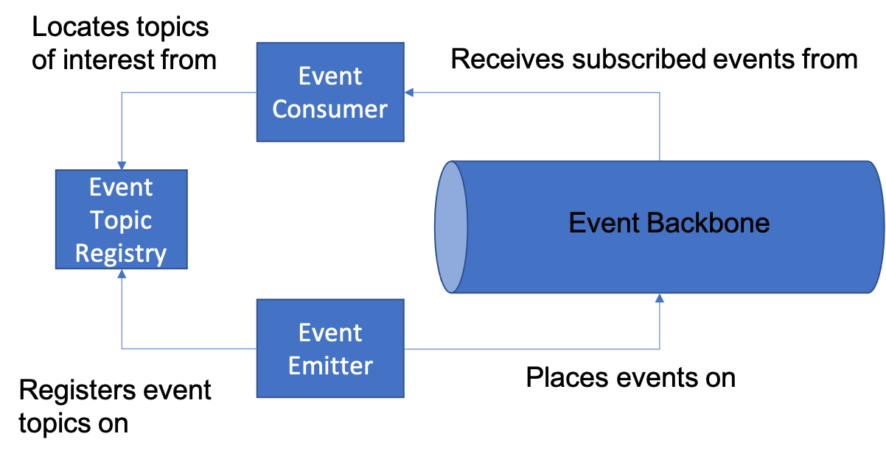

# Event Driven Architecture

Loose coupling helps the decomposition of a system or application into independent components, by minimizing the dependencies of each component on the implementations of other components which it uses. SOA formalizes the component service interfaces and interaction protocols so that any individual component can be replaced by any other with similar functionality and the same service interface  without compromising the correct behavior of the overall application. Component implementations and implementation changes are hidden from users of the provided services. 

The benefit of loose coupling is that an application can be evolved incrementally, replacing individual component implementations one at a time with enhanced versions while preserving the correct behavior of the overall application at each step.   Loose coupling as a concept can easily be extended to the use of Events.  An event is an announcement of an interesting occurrence of a phenomenon.  This idea then leads to a type of loose coupling we call “event coupling”.

The distinguishing characteristics of event coupling are: 

+	The interactions are "one-ended". An event producer emits an event; an event processor is notified of events matching his interests. 
+ Event interactions are notifications of something that has happened. They carry no intent that any particular processing or service is expected in response to the event. 
+	Event interactions are one-way transmissions. Since there is no implied service processing there are no defined responses or results to be returned to the event producer, ( although subsequent independent event interactions may allow any processors of the event to communicate back to any of the emitters ) 

Event coupling facilitates the smooth evolution of a family of applications, based on the event coupling characteristics described above. 

+	A completely new application can be added into the family with a new event handling service interface; by expressing an interest in appropriate events, processing in the new application will be initiated at appropriate times using appropriate event data as input, even though no other application or component in the preexisting family explicitly invokes it. 
+	New event producing components and applications may be added into the family. Their emitted events will trigger additional appropriate processing by event processors (even though the new event producer is not aware of what this processing is.) 
+	Intelligence may be added to improve the quality of event based matching and interactions - for example additional duplicate event detection and removal may increase efficiency of component interactions within the application family by eliminating redundant processing before the event processor is invoked. 

People need to evolve families of applications so that new applications and services can be incrementally added to the system introducing new paths of interaction between components. The new style of interaction should include:

+	Appropriate triggering of processing in newly added components and applications based upon existing occurrences of interest
+	Triggering of appropriate processing when new applications and components are added into the family that announce occurrences of interest
+	Incremental addition of systemic intelligence to allow more efficient and effective matching between the occurrences reported and the interests and needs of processing components. 

**How should a component announce notable occurrences so that other components can set themselves up to be informed when relevant items of interest have occurred?**

When a source component detects a notable occurrence, it could invoke a service on the target component to cause it to react to the occurrence. But that couples the source to the target, because the source has to know about the target to invoke its service, which means that the source cannot work without the target. It also assumes the source knows how the target will want to react, and that the target will always want to react the same way to every occurrence. It also assumes that there's only one target; for more than one, the source will have to know about all targets, know which service to invoke in each, and know which occurrences each target is interested in. And then the source will be coupled to all of those targets, such that it cannot run unless it has all of them.

Above is an event source components view of the forces at work. Consider the equally important forces as seen from the event consuming component's viewpoint. 

Consider a component with responsibility to assign corporate internal telephone numbers to newly hired employees. Does this component have to take responsibility to contact each Human Resources office to get information about new hires? For each employee this might require gathering information which became available at different times, and involve collecting this from a possibly varying set of Human Resources offices in the corporation. To bring all this information into the telephone numbering component and for analysis is inefficient; furthermore many other components need to be prompted with the same new hire event for other tasks such as: start paying salary, send welcoming mail package etc. There may be no single business process which understands everything which has to be done when a new employee is hired. Centralizing detection of notable events into an Event Backbone and making this event information available to interested components is much more efficient and allows for flexibility.

Hence we need a solution which supports definition of a mediating Event Backbone to which events can be reported and which supports subscriptions by components to pattern of events in which they are interested. Such an approach decreases event messaging traffic, increases the efficiency of event analysis, aggregation and correlation, and allows the dynamic introduction of new patterns of event information flow into a community of existing applications (without change to the existing applications). 

Therefore,

**We solve the problem described above by:** 
+	**Introducing an [Event Backbone](Event-Backbone.md) which provides which provides a level of indirection and mediations between event producing and event processing components.**
+ **Providing an [Event Topic Registry](Event-Topic-Registry.md) in which components can discover event channels relevant to their needs and lookup relevant channel information**  
+	**Allow [Event Consumers](Event-Consumer.md) to subscribe to patterns of events over time and from multiple sources**

You see the interaction of these components in the diagram below:

An Event-Driven Architecture extends loose coupling to event coupling in which because the targets are optional; the source announces the occurrence the same way whether the announcement goes to no, one, or multiple targets. It enables each target to receive the notification and decide how to react, if at all, such as which service to invoke.
