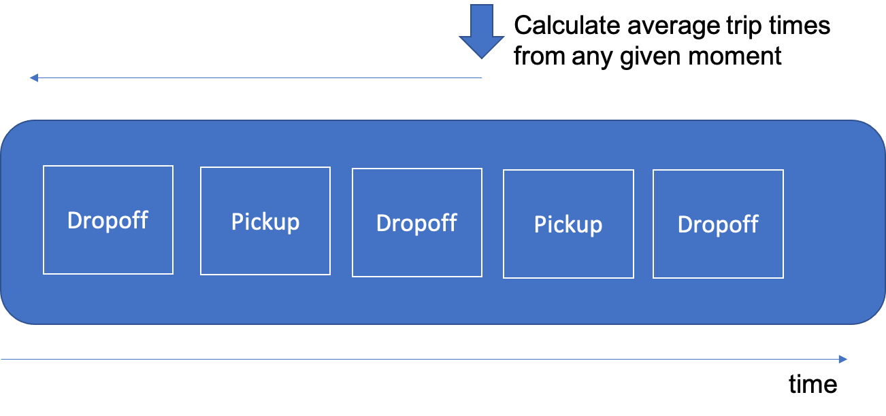

# Event Sourcing

When you are designing applications that use Events you often find that the approach of repseenting the state of your application simply in a "point in time" is not compatible with the overall architectural goals that Event Driven Architecture fosters.

Let's say that you're building an application to represent a complex, evolving process.  A simple example of this may be a car with a driver that's participating in a car-hailing service (like Uber).  All day long the driver will receive notifications of hails, decide whether to respond to those hails, pick passengers up, take passengers to locations, drop them off, and then repeat the process.  The problem with a "point in time" representation is that it is hard to keep up-to-date.  Waht's more, it's also hard to figure out the logic of how to "undo" things when conditions change.

For example, let's imagine that a driver receives a request to pick up a passenger.  We could say that the current state of the car is that it's "on a trip".  But what if the passenger cancels the request before they are picked up?  Or what if the passenger arrives at a destination only to let the driver know they only wanted to use an ATM machine and then be carried to another location, which was their real destination?  The conditions evolve quickly and are hard to represent in a static form.

**How do you represent a the state of an application that is constantly and unpredictably changing as a result of evolving conditions?**

Trying to represent this complex set of conditions as a single state variable would be difficult - you could implement it as a state machine, but there's always the chance that your state machine may not represent all of the possible "edge cases" of what can happen in reality - like Passengers cancelling both before the ride begins and after it begins, or the driver deciding they want to cancel the ride for some reason (like fearing their safety).  

Therefore,

**Record the state of the system as an ordered set of events.  Allow the application to query the current state by examining the recorded event stream.**

In the case above, you can find the current state of the car by simply examining the last event on the event stream.  But representing your application state this way brings other advantages too:

1. You can easily derive other information that is useful to the application by querying the event stream over time.  For instance, calculating the average trip time for a trip simply amounts to scanning the event stream from a given point (like the initial sign-in of the day) and then summing the timestamp differences between trip starts and trip completes, then dividing by the number of start/complete pairs found during that day
2. Undoing amounts to adding new events to the event stream that reverse previous actions.  Likewise, if you need to restore the state of an application to that of a previous point in time, you can simply replay the event stream from an earlier save point to that point. 

This kind of backward looking through time over an event stream is illustrated below:

This pattern was first elucidated by Martin Fowler in this [paper](https://martinfowler.com/eaaDev/EventSourcing.html)
