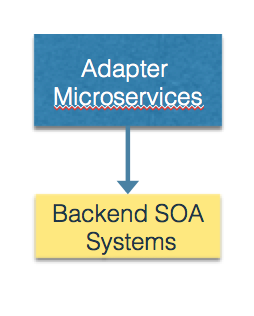

# Adapter Microservice

You are building an application that is following a Microservices architecture.  The team is not operating in a complete greenfield - there are existing sources of functionality or data that must be reused in order to complete the application on time and within budget.  However,

**This existing functionality cannot be migrated to a microservice architecture. We need a way to be able to take advantage of this functionality without abandoning the microservices approach.**

There are many different types of existing functionality that may requires you to reuse existing code.  It may be that there are specific enterprise data sources that can only be accessed through an existing API.  Or it may be that you want to take advantage of a cloud-based (SaaS) API from a clodu provider that provides some or most of the functionality that you would otherwise have to build.

Therefore,

**Wrap the functionality in an adapter. The adapter will (like the adapter pattern from [Gamma](https://www.amazon.com/Design-Patterns-Elements-Reusable-Object-Oriented/dp/0201633612)) convert from the existing interface to a new interface consistent with microservice principles (e.g. REST or messaging).**

Perhaps the hardest aspect to determining if you need to use an Adapter Microservice, particularly if the legacy service or Saas service already implements a RESTful interface, is whether or not to build an Adapter Microservice or simply use the existing REST API directly from your SPA or Mobile Application clients or your BFF's.  There are several reasons why you may want to build an Adapter Microservice of one type or another in order to improve the maintainability of your code.

1. You may not want to put yourself at the mercy of an existing service API.  Particularly in the case of a SaaS service, relying on an external API directly can get you into trouble if the API changes or the API provider discontinues support for the API.  In this case, putting in an Adatper layer gives you a level of isolation from the whims of the API provider.
2. The API provider's business entity model may not match your business model.  In this case, you may need a subset or a superset of the existing API in order to meet the needs of your system.  An Adapter layer allows you to recompose existing services or add additional service functionality to the API provider's API.
3. The API provider's QoS model may not meet the QoS needs of your application.  You may need to add caching to improve performance using a Results Cache or Web Cache, or you may need to improve availability by applying the Circuit Breaker pattern on top of the vendor's API.

The overall approach is shown below.

For legacy services we expect to be replaced over time, we call this a [Legacy Adapter Microservice](Legacy-Adapter-Microservice.md); for (external to the platform) SaaS services, a [SaaS Adapter Microservice](SaasAdapterMicroservice.md) can be used.
