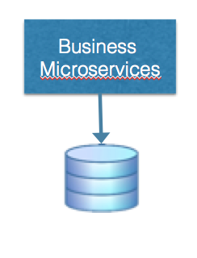

# Domain Microservice

You are implementing an application using the Microservices Architecture style or refactoring an application to use that architectural style. The application may run in either the cloud or on-premise.  You know you have a set of business logic that you must implement in order to provide the functionality of your application to your clients. 

Despite the hype associated with the microservices architecture it's not entirely clear from the basic microservices principles exactly what your microservices should do.  

**What should the scope of a single microservice in your application entail?**

There are some general principles we can derive from the definition of the microservices architecture:

-   Each microservice should implement one complete business function and only one business function.  Thus, an individual component of the overall solution should be limited in scope to a single business concept.

-   The primary quality of a business function is that it implements or otherwise provides business logic.

-   Business logic should be encapsulated inside an API.  That API can be provided through a RESTful interface or a simple messaging interface.

Therefore, 

**Develop each business function as a *Domain Microservice* that provides a unified API for that function and encapsulates the business logic to implement one domain concept (as a business function), and makes it composable with other business functions.**

The business functionality of an entire application is composed of individual business functions implemented as business microservices. Deciding to implement each business entity as a microservice is not the end of your design problems, however. You must also think about how you would implement the microservice and how that microservice relates to the other services in your overall business application.

One of the microservices principles described by [Martin Fowler](https://martinfowler.com/articles/microservices.html) and referenced above is that you should avoid indirect communication between microservices through a database. One of the ramifications of that principle is that each individual microservice will usually store its own data in a separate database. In order to allow those databases to scale at the same rate as the microservices, the decision is often made to use a [Scalable Store](../Scalable-Store/Scalable-Store.md) (often a NoSQL Database of some sort) instead of a relational database. This is usually because the native data representation that the microservice presents to the outside world in its REST interface (JSON or possibly XML) is more easily stored and retrieved in that format.

Earlier we referred to the development benefits that are accrued from following the microservices principles of Per Service CI/CD and Per-Service HA and clustering. Unfortunately these two benefits come with a shared drawback - adopting an approach of building multiple *Domain Microservices* means that you will have more operational complexity in your application than you might have if you followed a more traditional monolithic approach.

In particular, the increase in the number of application servers running your microservices means that there are more application logs to gather and correlate than you might have in a monolithic architecture. Likewise, this same increase means that monitoring the status of each individual microservice and debugging problems that may occur also becomes more complex. Thus, when building *Domain Microservices*, you may need to employ a [Log Aggregator](../Cloud-Native-DevOps/Log-Aggregator.md) together with an approach like [Correlation ID’s](../Cloud-Native-DevOps/Correlation-ID.md).

