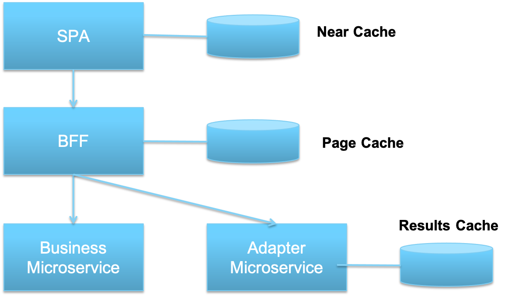

Page Cache
===
You are building a web or mobile application using a Microservices Architecture](Microservices-Architecture.md). You are applying the [Backend for Frontends](Backends-For-Frontends.md) Pattern to build dispatchers for a web or mobile application.  Your microservice that represents a business entity or concept may return a great deal of information.

**How can you effectively manage large data sets returned from a microservice so that they can be easily displayed, particularly on a mobile application, without a great deal of scrolling?**

-   You don’t want to re-fetch all of the data in a long list each time the list needs to be paged

-   You don’t want to spend unnecessary network bandwidth transmitting data that may never be viewed

-   You don’t want the user to have to wait a long time for data to be fetched before it is displayed.

Therefore,

**Use a *Page Cache* with your [Backend for Frontend](Backends-For-Frontends.md). The *Backend for Frontend* will present an interface that allows for the client application to request a limited subset of a much larger set of data. The information can be indexed by page number based on the total size of the dataset and the number of elements per page that can be displayed on the device.**

For very long datasets, a *Page Cache* is preferable to fetching all the data at once and storing it in a [Near Cache](../Cloud-Client-Architecture/Near-Cache.md) since you can render the first set of information more quickly – and in many cases, the user will never scroll past the first page of information.

However, when you do use a *Page Cache* in conjunction with a *Near Cache* it makes it possible to scroll backwards through the list more quickly – otherwise you would need to re-fetch the page data from the *Backend for Frontend* on both page down and page up requests.  The position of all potential caches in this architecture is shown below.

