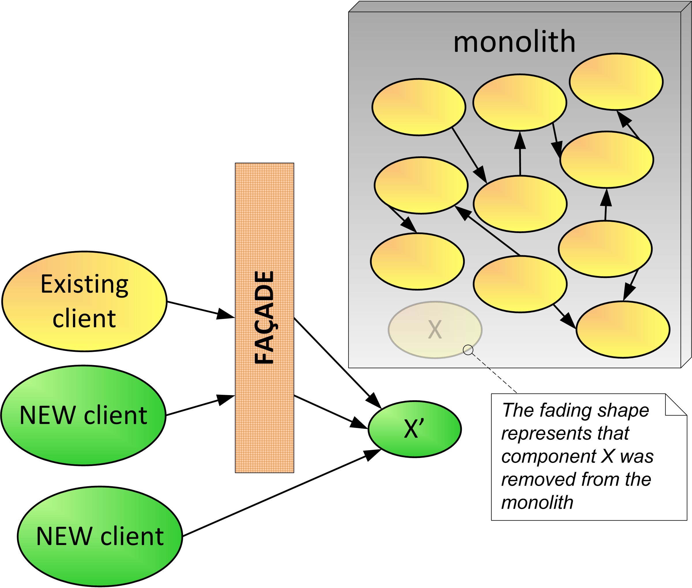

# Extract Component and Add Façade 
&nbsp;&nbsp;&nbsp;&nbsp;&nbsp;&nbsp;(aka Extract Service and Add Façade)

You have Started Small, Paved the Road, and began using microservices as part of your implementation. You have a monolith that has been providing value to your organization, but has become hard to change. There is some functionality you want available as a microservice New client applications need to use functionality in the monolith but require a different contract. 

**How can we make monolith functionality available as microservices without affecting existing client applications that access the monolith?**

Components from a monolith are being transformed into microservices as part of a long-term strangling process. These microservices use new component technologies, message protocols, and data formats that are different from what components in the monolith use. However, adapting the monolith to use the new technologies and message formats used in microservices can be expensive and difficult to implement.

There are existing client applications that use components in the monolith that are being extracted as microservices. However, due to technical or organizational constraints, updating and redeploying these old client applications to call the new microservice instead of the monolith components may not be feasible. 

The organization may have an API gateway or a similar application integration element available in their runtime infrastructure. However, this element is not currently being used to centralize calls to the monolith. 

Teams developing in the monolith would like to take advantage of features provided by the new microservices being developed. However, due to technical constraints, it can be difficult for components in the monolith to make calls to the new microservices. 

Therefore,

**Extract functionality out of the monolith into microservices, add a façade to route calls and transform messages as needed.**

Components are gradually extracted from the monolith and redesigned as microservices. Sometimes this is straightforward as there are components or services within the monolith that are not tightly coupled and can be extracted and wrapped as a microservice. If this is not the case, you might need to Replace as Microservice. Existing client applications or components that use services moved out of the monolith can be handled as follows:

*They can be rewritten to call the microservices. This option takes time to be rewritten and may not be achievable before these components become microservices. 
*They can remain unchanged and have their calls go through a routing interceptor—the façade component. The façade component performs the protocol bridging and message transformations for the existing client components to interact with the new microservices.

Figure 8 illustrates the application of this pattern to component X. The component is extracted and becomes microservice X'. An API Gateway or similar application integration product is a good candidate for the implementation of the façade element. Another option is to use the Backend for Frontend (BFF) pattern [2] to implement the façade logic. This approach is similar to the Wiping Your Feet at the Door pattern [10] and can be considered a type of an anti-corruption layer [11]. Note that façades are related to adapters, decorators, mediators, and proxies [13]. 

In addition to protocol bridging and message transformations, the façade component, which acts as a reverse proxy, can perform several operations, such as security controls, dynamic message routing, traffic monitoring, circuit breaker, and even caching. Figure 8 also shows that a new client application may also call microservice X' directly, if the extra features of the façade just mentioned are not required for this interaction. 

 
#insert FIG here...Figure 8—Extract Component and Add Façade

Note that in this example, X is decoupled from the rest of the monolith. Usually some detangling is needed to extract the component. If components inside the monolith were clients to X, then you can either adapt those clients to have them calling the new microservice X' through the intercepting façade, or if possible adapt them to directly call X'. Alternatively you could Proxy Monolith Components to Microservices, making X be a proxy to X'. 

  
* * *

  
  Whether you are Starting Small or not, you can Extract Component and Add Façade whenever desired functionality in the monolith can benefit from being moved to a microservice. Sometimes while doing this you may need to apply Macro then Micro. Some components can be extracted to microservices even if you need to rewrite some functionality (Replace as Microservice). Either way, for any functionality in the monolith that needs access to the extracted behavior, you can Proxy Monolith Components to Microservices.
The façade component has the benefit of enabling existing clients to seamlessly interact with the newly created microservice. However, there are trade-offs to consider. The façade is an intermediary that introduces a performance overhead. If not properly designed and monitored, it may become a performance bottleneck and a single point of failure. Besides, its implementation may use platform-specific technology that generates coupling to a given framework or platform. 
