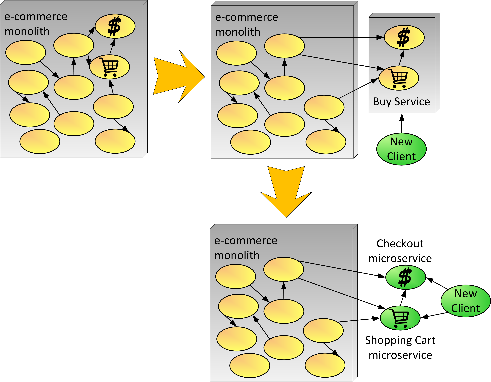

# Macro then Micro
&nbsp;&nbsp;&nbsp;&nbsp;&nbsp;&nbsp;(aka Divide and Conquer)

The decision has been made to evolve to using the microservice architectural style. Parts of the monolith include larger pieces that can be componentized and possibly extracted.

**How can we pull pieces out of the monolith and migrate them to be implemented with microservices?**

The monolith is a large deployment unit that encompasses functionality pertaining to different subdomains. Some changes to the system require changes across subsystems, sometimes creating bugs or other issues. Teams don’t have a full understanding of the domains and subdomains.The monolith has certain larger components where analysis has shown that pieces can be broken out.

There is a desire to pull out pieces that are causing pain and start using new protocols, languages, and more—specifically by implementing pieces using microservices.

There are different development teams that work on different parts of the monolith. These teams would like to change the system without affecting large parts of the monolith or without having to release the monolith.

Static-code analysis and other architecture conformance mechanisms were not used during most of the monolith evolution. Developers had freedom to take shortcuts and add dependencies across components within the monolith when implementing new features or fixing bugs. As a result, the monolith is significantly tangled. Component interdependencies make it difficult to isolate fine-grained, cohesive components.

There are some larger components that contain a lot of smaller pieces of functionality that can be pulled out into their own component(s) or service(s).

Therefore,

**Pull out pieces that you can extract even if they might be a larger “macro” service. After extracting, refactor to break the larger service down to smaller microservices.**

This strategy is more challenging when trying to extract pieces out of a monolith. A monolith usually has larger pieces or components that are tightly coupled and harder to extract as smaller pieces without a lot of refactoring. In these cases pulling out a larger piece can make the effort to refactor easier. An example can be seen in Figure 6. In this example the “Buy Service” is first extracted out of the monolith. This service is a first step toward microservices, but it can be a larger service especially if it has some couplings which make it difficult to extract into smaller pieces. Once this intermediary solution is stable, we can more easily separate the “Buy Service” into two separate functions such as “Shopping Cart” and “Checkout” services seen in the example. Once the service is extracted out, new clients can begin to access and use the functionality of the new microservices.

 
#insert FIG here...Figure 6—Macro then Micro Evolution

* * *

Sometimes you can apply the Macro then Micro strategy by Extracting Component and Add Façade, then break it down into smaller services. If the functionality is tightly coupled in the monolith, you may need to completely rewrite the functionality (Replace as Microservice). Whenever the monolith needs to access new services, you can Proxy Monolith Components to Microservices.

An advantage to Macro then Micro is that teams can take advantage of microservices sooner while they learn how to evolve the domain to more manageable pieces. Sometimes you don’t know where to partition the domain, and this pattern allows you to extract functional pieces (albeit larger than desired) then break them down later (divide and conquer). These larger functional pieces are usually modeled around bounded context pieces of the domain. Note in Figure 6, “Buy Service” is well defined as a subdomain part of e-commerce and thus could evolve to smaller pieces within that bounded context. Domain Driven Design (DDD) [11] has become a popular technique for modeling the domain and finding the right size services as the system evolves.
