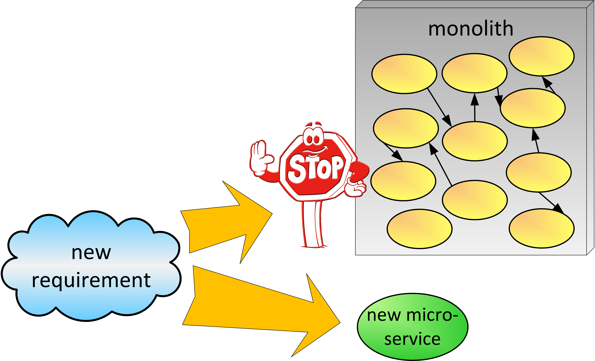

# Microservices First Strategy
&nbsp;&nbsp;&nbsp;&nbsp;&nbsp;&nbsp;(aka All new functionality as Microservices)

The decision has been made to evolve to using the microservice architectural style. The organization has Started Small and Paved the Road toward using microservices.

**How can we encourage people and teams across the organization to start evolving to microservices?**

During the long-running process of strangling a monolith, it’s natural that developers and especially managers feel inclined to add pieces of functionality to the monolith. Doing so is typically faster and less expensive than providing the same functionality as a microservice. If there are no design standards or policies set forth to require new functionality to be created as microservices, the monolith may see occasional growth despite the strangling effort. 

Many developers work on the monolith. Some of them may not fully engage in microservice development, perhaps because they didn’t get acquainted with the new technologies and tools. These developers are more prone to keep adding code to the monolith, including services that should be created as microservices. 

Some in the organization—possibly new to the organization—feel the urge to create microservices. They see potential technical and business benefits.

The shiny new object effect: microservices is the shiny new technology and some developers want to experiment with it.

There are certain requirements or needs that could benefit from new technologies that are hard to implement within the monolith.

Therefore,

**Whenever adding any new functionality, whenever possible add it as a microservice. This directive includes making it easier to add the functionality as a microservice and to also make it harder to add the functionality in the monolith.**

The main objective is to avoid or contain the growth of the monolith. Sometimes this is done by communicating and encouraging teams to add new functionality using microservices. Some team members or developers are excited to do this and the system can start to see some of the benefits. Teams can also be encouraged by creating templates or examples (Paving the Road) making it easier to add the functionality with microservices.

On the other hand it is usually the case that many teams and developers are more comfortable with changing the monolith and will be tempted to take the more expeditious way to add the new feature by relying on what they have always done in the past. In these cases organizations might want to take the approach of adding “speed bumps” such as using a governance committee. This committee permits new code to be added using microservices, but if you want to change the monolith, you need to convince the committee why the change should be done this way. Figure 5 illustrates this situation. 

* * *

When applying the Microservices First Strategy, you often Start Small and apply Macro then Micro. While implementing a new requirement with a new microservice, you can sometimes see where to Extract Components and Add Façade; other times you will Replace as Microservice some functionality. While adding new microservices, you will Proxy Monolith Components to Microservices as needed.

An advantage of Microservices First is that the organization can expedite the migration to microservices thus reaping the benefits of microservices throughout the organization sooner. There is an additional advantage of not making things worse in the monolith. However it is possible that it could take longer to implement new features as you cannot quickly add the feature in the monolith such as using copy/paste techniques. Also, there is a cost for providing the training, tools, people and support for microservices. Finally there is time and effort for setting up a governance committee which also can slow down any development that needs to be done in the monolith. 
