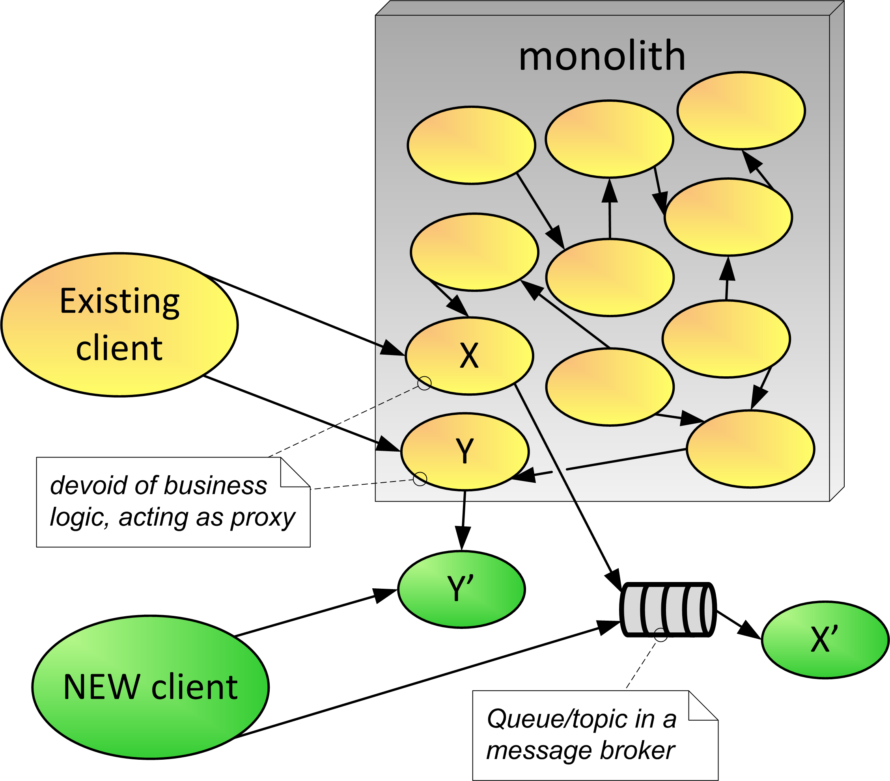

# Proxy Monolith Components to Microservices 
&nbsp;&nbsp;&nbsp;&nbsp;&nbsp;&nbsp;(aka Proxy Monolith Service to Microservice)

You have a monolith that has been providing value to your organization and parts of the system are becoming harder to change.

**How can logic that was once in the monolith and is now implemented as microservices be accessible to existing and new client components?**

During the long-running process of strangling a monolith, components in the monolith are gradually replaced with microservices. The microservices may use protocols and message formats that are different from what is used in the monolith. However, evolving the monolith to use the same standardized message formats used in microservices can be expensive.

There are old client applications that use a component in the monolith that is being extracted as a microservice. You would like these clients to take advantage of features provided by the new microservices. However, due to technical or organizational constraints, updating and redeploying these old client applications to call the new microservice instead of the monolith component may be challenging. 

You would like to have the monolith take advantage of the new features provided in the microservices. It is technically feasible for components in the monolith to make calls to the new microservices. However, the cost and risk of updating a large number of components in the monolith to call the new microservices is high.

Therefore,

**As you move functionality out of the monolith components into micro services, keep the old components in the monolith solely as proxies to redirect calls to the new microserves.**

In this variation of Strangler, old client components remain unchanged. Monolith components that were rewritten as microservices no longer process the calls. These components still expose the same contract, but all they do now is to route calls to the new, microservice-based implementation. Therefore, instead of adding a façade interceptor component, in this variation we have the monolith components acting as proxies to the new microservices—in a sense, the monolith is being converted into a façade. Because new microservices may have different contracts, monolith components acting as proxies may need to perform the message transformation and protocol bridging. 

Figure 9 illustrates the application of the pattern to components X and Y. The components are extracted and become microservices X' and Y'. The diagram illustrates the fact that extracted services can be synchronous or asynchronous. For example: service Y' can be a synchronous REST service, and service X' can be a consumer of a message queue (e.g., a Kafka topic) and hence be activated by asynchronous messages or events. In this example Y is proxying directly to Y’, while X is proxying by sending a message to a queue that X’ subscribes to.

 
#insert FIG here...Figure 9—Proxy Monolith Components to Microservices

 
* * *

 
Whether you rewrite pieces in the monolith (Replace as Microservice) or Extract Components and Add Façade, if components in the monolith need access to the new microservices, it is common to Proxy Monolith Components to Microservices. There are possible failure scenarios inherent in distributed systems that must be dealt with when applying this pattern. These failures could compromise meeting the reliability and performance requirements of the system.

Unlike Extract Components and Add Façade, this pattern does not require creating, configuring, and monitoring a façade component to allow existing clients to seamlessly communicate with new microservices. Therefore, this pattern is in general easier to implement and govern than the previous one. However, similar to the solution with the façade, the performance overhead exists of an extra network hop. 

This pattern requires rebuilding and redeploying the monolithic application whenever a component gets extracted as a microservice, which was not the case with the façade solution. The main benefit of this pattern over the façade solution is related to handling calls from within the monolith. Figure 9 shows that components X and Y are called by an existing outside client application and also by other components inside the monolith. These clients in the monolith are unaffected by the solution because they still see the same contract exposed by X and Y, even though the actual business logic got deferred to X' and Y'. We don’t have that benefit with Extract Components and Add Façade. In that pattern, internal clients would need to be adapted to calling the new microservices, as the façade typically would not be intercepting the in-VM calls within the monolith. 

This pattern is a variation of the traditional Proxy pattern [13] for distributed systems. In this case, the proxying components are also known as remote proxies or ambassadors.
