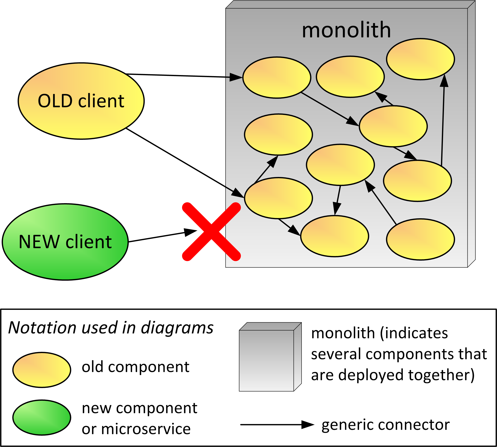

# Strangler Patterns Introduction

(NOTE: A LOT OF THIS IS DIRECTLY OUT OF THE PAPER AND SHOULD BE EDITED!!! ALSO I LEFT FIGURES REGULAR SIZE to have the best resultion. We can resize.

Over time even a great design can be compromised by successive architectural revisions, especially as technical debt grows. In 1998 the claim was made that the architecture that actually predominates in practice is the Big Ball of Mud [1]. Big Ball of Mud (BBoM) architectures are still seen today. They are the culmination of many design decisions that gradually result in a system that can be difficult to change and maintain. However, BBoMs usually do not result from well-intentioned design ideas gone wrong. Nor are they simply an accretion of expedient implementation hacks. Rather, they can be a mix of doing what it takes to meet business requirements along with obliviousness to technical debt growth and no time given to address these needs.

Since 2014 the “Microservices” architectural style has been increasingly adopted by many organizations to better address business needs. Microservices encapsulate different parts of the application as independently deployable units that contain their own application logic, data, structure, and more. After the new term “microservices” appeared, previous systems or architectures developed were labeled as “monoliths.” Unfortunately the term monolith gained a bad connotation inasmuch these systems are viewed as legacy systems or BBoMs. Developing a system using the monolith architecture style is not necessarily a bad design decision as outlined by Richardson [2].

Many companies are successfully adopting the microservices architectural style and reaping benefits such as shorter development times and increased flexibility for experimenting with new ideas and technologies. However, most organizations have existing systems that were developed before microservices and still provide value. As organizations evolve, a monolithic system can become harder to maintain and hinder the ability to keep up with new business needs. The poor flexibility of monoliths has driven many organizations to apply the microservices architecture style which leads to the question: ‘What to do with the existing monolith?’

Martin Fowler coined the term “Strangler Application” as a metaphor in 2004 to describe a way of rewriting an important system. The “Strangler Application” is based on an analogy to a vine that strangles a tree that it’s wrapped around. The main idea is to gradually evolve the system by replacing / rewriting existing components or by adding functionality as new components, all or mostly outside the old system until the old system has been “strangled,” that is replaced. Fowler renamed this to “Strangler Fig Application.” The strangler application idea is independent of services because you can evolve the system around the old without adding or evolving services.

* Footnote: “One of the natural wonders of <the rain forests of the Queensland coast of Australia> are the huge strangler figs. They seed in the upper branches of a fig tree and gradually work their way down the tree until they root in the soil. Over many years they grow into fantastic and beautiful shapes, meanwhile strangling and killing the tree that was their host.”					    https://martinfowler.com/bliki/StranglerFigApplication.html
  
Typically a monolithic application is packaged as a single deployment file that runs on an application server. The monolith consists of many components that may contain business logic from various subdomains. These monolith components can include services, modules, libraries, or any type of implementation. They also have dependencies among themselves that typically increase over the years. Monolith components that are visible on the network may use protocols, message formats, and API design standards that are not fully compatible with network calls being used in new client applications. For example, the monolith may provide EJB services, and new applications in Python are not able to directly call these services. The general scenario is illustrated in Figure 1. The generic connector symbol (→) in the diagram may represent a HTTP request to REST service, a platform-specific invocation mechanism, or an in-process call to modules in the same deployment unit. In a real project scenario, different types of connectors may be used in the design. Note that in this diagram the components appear to be mostly decoupled but in reality, there is usually a lot of coupling in the monolith architecture. The red “X” illustrates that new code is written to avoid directly accessing the monolith.

#insert FIG here...Figure 1—monolith general scenario

One of the first decisions to make is whether to completely rewrite the monolith or apply [Strangler](Strangler.md). Sometimes rewriting the monolith is the right approach. Sometimes the monolith needs to be reconceptualized and implemented from scratch (possibly using microservices). However, it is usually the case that the cost and duration of a complete rewrite make it infeasible. If the monolith has become hard to maintain, is hindering new projects, and rewriting it is not a viable path, then it is time to apply [Strangler](Strangler.md) and gradually migrate the monolith. Once you have decided to do an evolutionary application of the [Strangler](Strangler.md), there are many possible variations. Figure 2 is a pattern map of various “strangling” approaches and the relationships between the patterns. Monolith Application and Complete Rewrite to Microservices noted in italics are not considered part of the patterns presented in this paper.

#insert FIG here...Figure 2—Strangler Pattern Map (MAYBE CREATE NEW FIGURE USING KYLE'S PATTERN MAP IDEAS

* [Wrapping the Monolith](Wrapping-the-Monolith.md) Once the decision has been made to apply Strangler, it is usually a good idea to decide whether you need to protect the system from change by [Wrapping the Monolith](Wrapping-the-Monolith.md). [Wrapping the Monolith](Wrapping-the-Monolith.md) is commonly achieved by creating a proxy or façade for existing external systems.
* [Pave the Road](Pave-the-Road.md) If the team is facing their first microservice project, you need to make sure you have the infrastructure and the environment (both technical and organizational) to make it easier to implement microservices ([Pave the Road](Pave-the-Road.md)).
* [Start Small](Start-Small.md) Starting Small—by having a team implement some new functionality—is a good way to learn about microservices principles.
* [Microservices First](Micrsoervcies-First.md) Once one or a few microservices have been successfully created, the team might redirect any new development efforts to add new features or functionality by implmenting it with microservices first if possible. 
* [Macro then Micro](Macro-then-Micro.md) Sometimes you are not sure how big the microservice should be so you might start with a bigger service then refactor it to smaller services as you learn the domain and more about microservice design.
* [Replace as Microservices](Replace-as_Microservice.md) Freeze the functionality in the monolith and completely re-implementing the functionality with microservices.
* [Extract Component and Add Façade](Extract-Component-and-Add-Façade.md) Refactor and move components out of the monolith, implementing them as microservices. Use a Façade to deletgate to the new contract or use a different type of connector and message format. 
* [Proxy Monolith Components to Microservices](Proxy-Monolith-Components-to-Microservices.md) A design solution is needed to address the discrepancy between old client components, inside or outside the monolith, and the new microservice. This patterns provides a proxy from any existing monolith components to either extracted or new created microservices needed by the monolith.

