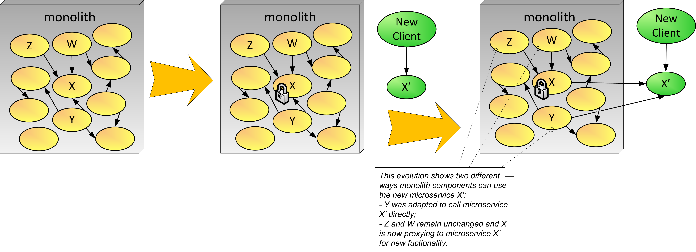

# Replace as Microservice
&nbsp;&nbsp;&nbsp;&nbsp;&nbsp;&nbsp;(aka aka Extract to Service, Replace as a Service)

The decision has been made to evolve to using the microservice architectural style. Parts of the system have been written using microservices. Other parts of the system that are changing a lot are still in the monolith and causing some challenges.

**How can we extract important tightly coupled monolith components to microservices with minimal impact?**

New features typically require several pieces of the monolith to change in a coordinated fashion. You would like to extract parts of the monolith that are changing a lot to use the microservice architectural style. However, the monolith is tightly coupled with many dependencies between internal components.

You would like for teams working with the monolith to evolve and take advantage of new technologies. However, the team that is responsible for the monolith might not be willing to add features or evolve the monolith in any way. The team might have budget or time constraints, or maybe the monolith is a legacy system that uses deprecated technology and they simply decided not to evolve it.

The organization has moved to use continuous delivery for the deployment of its software solutions to improve agility and shorten the build-test-deploy cycle. However, the monolith has grown large and it is getting hard to change it without affecting large parts of the system. Also, its deployment requires the coordination of several development and DevOps teams, making it infeasible for continuous delivery 

Therefore,

**Reimplement critical components or functionality from the monolith as microservices. While doing this, lock down this part of the functionality in the monolith.**

Some core pieces of functionality are tightly coupled within the monolith, and hence are almost impossible to extract from the monolith. The functionality in these core pieces is nonetheless needed outside the monolith, and it would be useful to make them available as microservices. This scenario warrants the option to rewrite a component that provides core functionality as a microservice—an example of such component is X in Figure 7. The new version is microservice X', and it becomes the primary locus for that functionality. The original component X in the monolith is locked down (frozen) from evolution. New client components should call microservice X' instead of X. As microservice X' evolves, a client component of X inside the monolith may need to access functionality that is in the microservice. In this case, there are two main alternatives. One is to rewrite the client component to call X', as shown in Figure 7 for component Y. The other is to have component X proxying calls to new features in X', as described in Proxy Components to Microservices. This alternative could be in use for Z and W in Figure 7. 

The following outlines the steps for the Replace as Microservice approach.
* Code-freeze the functionality in the monolith.
* Create a new microservice implementing the functionality that you want to replace.
* Canary Release [7, 12] the new microservice while carefully testing.
* Gradually make old client components call the new microservice instead of the old component in the monolith.
* Eventually remove the extracted functionality if feasible.

* * *

Sometimes the part of the system you want to extract is tightly coupled and hard to extract. In these cases, you lock down (freeze) code changes to this functionality in the monolith. If any components need access to the new features in X', then they can either directly call X' or you can Proxy Monolith Components to the Microservice from X to X'. If Y is a larger component, you can apply the Macro then Micro approach.

If on the other hand, you can refactor part of the system into components or modules, removing some dependencies, then you can use the two patterns discussed next, [Extract Component and Add Façade](Extract-Component-and-Add-Façade.md) and Proxy Monolith Components to Microservices.

Replacing functionality with microservice provides flexibility and the benefits of being able to use new technologies, frameworks, and platforms. Also, teams can experiment with new ideas with less risk of breaking the monolith. On the other hand, the organization loses the benefit of adding features in the monolith for that frozen piece of code. Also it can be complex for pieces in the monolith to take advantage of the new features implemented in microservices. Finally, there could be data-syncing issues between the data store in monolith and data stored in the new microservices; specifically in the data used in the frozen code. 

