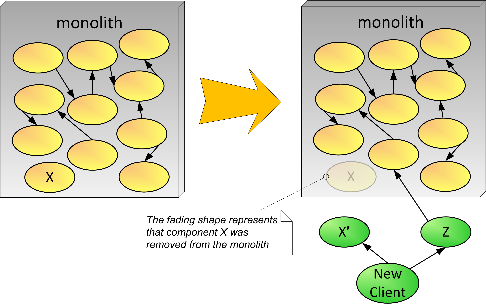

# Start Small
&nbsp;&nbsp;&nbsp;&nbsp;&nbsp;&nbsp;(aka Gradually Evolve the System, Baby Steps)

You have a monolith that has been providing value to your organization. The software is growing and changing quickly, and evolving the monolith is getting harder. The decision has been made to use the microservice architectural style.

**How can we start evolving to microservices?**

The organization wants to minimize or amortize cost to evolve to the new microservice architectural style and would like to do this fully as soon as possible. 

Teams and people want to start right away and successfully implement microservices. However, the organization is not ready for a major move to microservices in terms of infrastructure and operational practices. The operations team worries about the prospect of microservices creeping everywhere. 

Only a few of the developers have the technical skills and the drive to create microservices. Thus, we look to these developers to overcome the hurdles in creating the first microservices, and show the way to the others. 

Therefore, 

**Take baby steps when starting. Start small, either by writing some new functionality with a microservice or take out a small piece putting it into its own service.**

The main thing here is to start small. This can be done either by implementing something simple or by pulling a few existing items out of the monolith. This is a good way to warm up if you have some simple and fairly decoupled capability. Figure 4 illustrates that these initial steps toward microservices can involve moving a simple component out of the monolith (X in the figure, which is recreated as microservice X'), as well as creating new logic as microservices (Z in the figure). The diagram shows that a new microservice (Z) may need to make service calls to the monolith, which is still a one-stop shop for most functionality. Figure 4 shows a fairly decoupled component (X) being removed from the monolith and reimplemented as a microservice (X'). Extract Component and Add Façade and Proxy Monolith Components to Microservices provide solutions if you need to adapt existing clients to call X'. The scenario where component X is being called by other components within the monolith is addressed either by adapting those calls to call X' or by the design solution described in Proxy Monolith Components to Microservices.

 
#insert FIG here...Figure 4—Start Small example

Note that evolving to microservices requires a minimum level of operational readiness. It requires having a DevOps deployment environment, with a continuous delivery pipeline to independently build, test, and deploy executable services, and the ability to secure, debug, and monitor a microservice architecture. Operational readiness maturity is required whether we are building greenfield services or decomposing an existing system. These early baby steps can help teams understand microservice architecture better, including getting the needed infrastructure in place. This evolution to operational readiness impacts the organization which will need to evolve and adapt practices.

* * *

This pattern is closely related to [Pave the Road](Pave-the-Road.md), which can add organizational and technology elements that encourage and enable the successful initial steps prescribed by Start Small. Adding these elements doesn’t happen at once. More likely, the organization will run a pilot microservice project that will drive the adoption of tools, technologies, and practices. This pattern is similar to Baby Steps in [Fearless Change](https://www.amazon.com/Fearless-Change-Patterns-Introducing-paperback/dp/0134395255).

The Start Small pattern sometimes uses the [Macro then Micro](Macro-then-Micro.md) approach where you extract some components from the system into services and if needed Proxy Monolith Components to Microservices. It might be a small simple step to extract something larger from the monolith and as you learn. You then later further refactor them into smaller microservices. Once you have been successful Starting Small, the organization can begin to use the Microservices First strategy, avoiding adding anything to the monolith.

The main advantage to Starting Small is that the organization does not incur the high cost and risk of a widespread change in technology. Initial microservice projects face several challenges and technical roadblocks. By Starting Small, future microservice projects won’t have to pay the same price because you are able to apply principles that you learn from these beginning projects. Also by Starting Small, you can potentially get some benefits sooner from microservices (new technologies, small changes, etc). On the downside, microservice adoption will take longer and you have to maintain and govern the old monolithic systems as well as the microservice solutions for a long time. The diverse technology increases the total cost of ownership (TCO). Finally it takes longer to get the full benefits of the new architecture because there is this slower evolutionary process, specifically because you are taking baby steps rather than “commit and move forward” with most of your teams.
