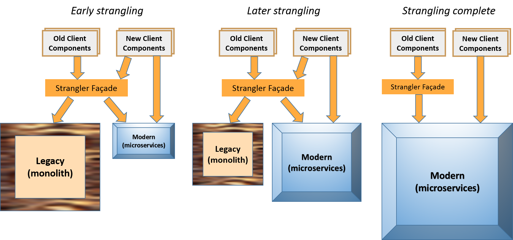

# Strangler Application
&nbsp;&nbsp;&nbsp;&nbsp;&nbsp;&nbsp;(aka Strangle the Monolith, Evolve System with Microservices)
   
You have a monolith that has been providing value to your organization for some time. The software requirements are changing more rapidly than your organization can accommodate; adapting the software, adding features, and managing existing features in the monolith are difficult due to: (i) significant coupling between components in the monolith, or (ii) significant synchronization complexity in the deployment process among the teams working on the monolith. Sometimes the need for rapid changes to the software comes with a need for the organization to evolve and grow. The decision has been made to evolve to using the microservice architecture style.

**How can we start evolving the overall architecture to better meet the needs of the organization, specifically an evolution to microservices?**

A legacy monolith is used by several client applications; the monolith and those applications are still providing value to the organization. There is a lot of code and tight coupling within the monolith that make rewriting it expensive. Adding functionality to the monolith is becoming harder and sometimes creates bugs. 

When migrating legacy applications you often need to consider how to replace the application in a piecemeal way. A legacy monolith rarely shows obvious semas for separating it cleanly. How can we replace it with a Microservices Architecture without doing a full rewrite? A full all-at-once rewrite and replace is a risky operation and would also be expensive and would not show value until the complete rewrite is finished.

There is a desire and sometimes potential benefit to use new protocols and technologies. However, client applications make use of the monolith by calling services that use old protocols and technologies (e.g., SOAP, EJB) or by adding module dependencies to the monolith and directly calling the logic inside it. 
New applications being developed use different technologies, programming languages, frameworks, and API design standards from those used for the monolith, thus limiting reuse of the monolith by these new applications.

Deployment becomes difficult—it requires testing the whole system because the changes might have affected other functionality. You also have to redeploy the whole system with downtime that is increasing with the size of the deployment unit.

Therefore,

**Gradually create microservices that are independent of the monolith, growing them in number over time until the monolith is replaced (strangled) by the new microservices. Redirect requests for these new services as needed.**

The main idea of the strangelr application is to use an approach that allows you to avoid a full "big-bang" rewrite and replace, yet still allows you gradually evolve and replace the monolith. This is done in anevolutionary process that redirect requests for parts of the applications from the legacy monolith and towards a new "microseervices" implementation of those features. This is done by adding these features incrementally (the strangler application) and updating the redirection logic towards the new features as they are added.

You have a useful legacy system that is a monolith. There is the need to develop new applications that use different programming languages, different frameworks, or simply newer incompatible versions of languages or frameworks. Consequently, these new applications cannot directly call components in the monolith. Perhaps the software needs to evolve or grow rapidly, but it is getting harder to evolve the current system. The following situations can complicate the process of transforming a monolith to microservices:
* A monolith uses old versions of libraries and frameworks. Developers want to upgrade to the latest versions, but the upgrades are not fully backward compatible and require updating a lot of code in the monolith. These upgrades have been postponed time and again over the years, and now the discrepancy between the old version and the latest makes the upgrades costly and risky. 
* The monolith was written in a programming language that is no longer the best choice for the current context at the organization. 

Extracting logic out of the monolith into microservices may create a situation where the same logic needs to be accessed by both old and new client components. Existing clients need to access the logic the old way, and new clients will access the logic the new way, using current protocols and API standards. A general approach is to create a proxy or façade for old external systems or client components (see Figure 3). This façade sits between the client components and the logic that exists in the monolith which is being moved to microservices. 

Initially, this façade doesn’t do anything but pass all traffic, unmodified, between old client components and the legacy application (monolith). This approach is a way to Wrap the Monolith to protect old clients from change. As microservices replace monolith components, this façade transcodes protocols from old clients into the protocols, technologies, and contracts used by the new system being created. Note this could be a two-way façade as there could be communication coming back from the monolith to the old client components.

Eventually the legacy monolith becomes strangled and can be removed. This evolution is notionally represented in Figure 3. Note that even when the strangling is complete, there could be some old client components that might not be updated thus still needing the façade.

* * *

Many people don’t consider Strangler because they believe it will cost more—specifically because you have the old and new systems to maintain. However, trying to refactor or completely rewrite the monolith can be costly and time consuming. An important reason to consider Strangler over a cut-over rewrite is reduced risk. Another is cost amortization, because many organizations cannot afford an overall rewrite of the monolith in a single undertaking. The main idea is to incrementally migrate functionality from the monolith to the new strangler application, focusing on high-value items or tasks first. 

One goal of strangling is to make it an evolutionary process. It is a good idea to [Start Small](Start-Small.md) and [Pave the Road](Pave-the-Road.md). Also it is desirable to make it so that changes do not break existing functionality and to limit making changes to any client code that needs access to the new microservices [Wrap the monolith](Wrap-the-Monlith.md)). There are different variations that can assist with this goal. One way is to [Extract Components and Add Façade](Extract-Components-and-Add-Facade.md). This pattern enables any client calling code to continue to access the desired functionality. Other times you could rewrite parts of the monolith (Replace as Microservice) and Proxy Monolith Components to Microservices, thus any old monolith code will continue to work.
Applying Strangler enables the system to continue to provide value as the system evolves. Having many frequent releases helps you monitor its progress while adding new functionality, thus making sure the monolith system continues to function properly. As features are migrated to microservices, parts of the monolith become strangled and these parts can be retired. 

Even with the above mentioned benefits there are also trade-offs when applying the Strangler. The main challenge is related to data. A monolithic application typically uses a centralized database, whereas microservices typically follow the Database per Service pattern [2]. The simplest alternative is for an extracted microservice to directly access the monolith database, but that alternative creates undesirable coupling and, if applied, should be temporary. There are different alternatives for “extending the strangling” to the database using database refactoring [5]. A common alternative requires replicating the data across a dedicated microservice data store and the monolith data store. This option increases the design complexity, requires the implementation and constant overseeing of a data synchronization mechanism, and may cause the monolith and/or the microservice to access stale data due to the eventual consistency setup. Another challenge of the Strangler is the extra effort to maintain and govern two types of software architectural styles—the monolith and the microservice—that typically use different implementation technologies, runtime environments, infrastructure elements, and deployment procedures. This technology diversity may significantly increase the total cost of ownership (TCO) for the organization. Finally, because the strangling process is usually a gradual evolution, it can take quite a bit of time to take advantage of the new architecture. 

An idealistic goal is to completely strangle the monolith (the monolith is gone). Although you might be able to completely strangle the monolith, there are cases where the benefit of doing so will not be worth the effort. Sometimes, part of the monolith can provide value and feeds the new microservices architecture, but is not worth completely rewriting. For example, some core pieces of the monolith are providing value and not changing. You have wrapped these pieces so that they are easy to use. Perhaps a core piece of code is entangled and quite difficult to rewrite or extract; it could make sense to leave this code as-is. This is especially true if you have addressed the essential problems in the monolith and don’t need to go any further.

