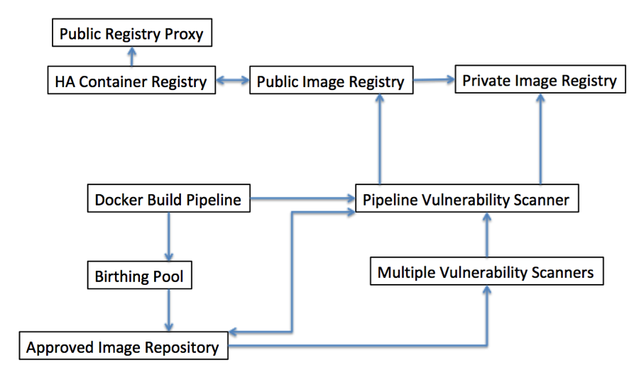

# Container DevOps Introduction

This part of our pattern language is concerned with the problems inherent in building and delivering software using Containers,
particularly those issues that arise during the process of mapping docker images and containers into the stages of a software development
lifecycle. The language assumes that the reader will be building applications following an agile approach that is characterized by 
Continuous Integration/Continuous Delivery

Containers are one of the most rapidly adopted software technologies of the last several years, with extraordinary growth in adoption (see [PortworxSurvey](https://portworx.com/2017-container-adoption-survey/)). This rapid adoption is the result of an impressive increase in developer productivity and ability to delivery cost reduction resulting from container adoption (see [Synopsis](https://www.synopsys.com/blogs/software-security/container-adoption-numbers/)).  Containers are the instantiation of immutable *images* that describe a process that will run in its own virtualized memory and processor space.

A *registry* is a service for storing and retrieving Container images.  You can think of it as being like a source-code control system (e.g. Git) for images.  There are two general types of registries; a public registry is one that provides this service to many customers where the images are publicly available and searchable.  Examples of this include Docker Hub, the Amazon Elastic Container Registry, and the IBM Container Registry service.  A private registry is one that serves a single customer. Both types of registry may be cloud hosted, although private registries are sometimes also deployed on premises.  For instance, in Docker you can deploy your own registry services and store your images locally or in any other location running docker (such as a hosted private cloud).

A *repository* is a collection of related images that have unique tags.  A tag is an alphanumeric identifier for an image within a repository.  For instance, Docker Hub allows you to create new repositories via the “Create Repository” function.  This named repository then becomes a common name that is used as part of the identifier of images within a docker push or docker pull, e.g. *docker push user/repository-name:tag*.  Other registries also support similar approaches to creating repositories.

# Patterns in this section

+ [Container Build Pipeline](docker-build-pipeline.md) is the root pattern of this section of the pattern language.  A DevOps pipeline is a core concept for Continuous Integration/Continuous Delivery.  An issue many teams face is where to introduce docker into their delivery processes.  Starting with an automated delivery pipeline for building and deploying your container images leads to the other patterns in this section.
+ [Pipeline Vulnerability Scanner](cicd-pipeline-vulnerability-scan.md) enables you to perform static vulnerability scans as a stage within your [Docker Build Pipeline](docker-build-pipeline.md) in order to scan your container image(s) for any known vulnerabilities and stop the deployment and report the issue if any issues are found.
+ [Registry Vulnerability Scanner](registry-vulnerability-scanner.md) gives you the ability to scan images *after* they are built, so that new vulnerabilities that are detected after a build can be detected and addressed.
+ [Multiple Vulnerability Scanners](multiple-vulnerability-scanners.md) addresses the issue that different vulnerability scanners use different approaches and pull threats and malware definitions from different repositories.  Teams should hedge their bets by scanning images in multiple ways.
+ [Birthing Pool](birthing-pool.md) is a way to avoid placing an untested image into an environment shared with other development stages, allowing malware present in that image to affect those other stages.
+	[Public Image Registry](public-image-registry.md) is a solution for making images available to others who may be outside of your development organization.
+ [Private Image Registry](private-image-registry.md) is a solution for making images available to those within your organization, particularly useful in cases of intellectual property restriction or security restriction.
+ [Approved Image Repository](approved-image-repository.md) is the location for approved images once they have been through the scanning and vetting process.
+ [HA Container Registry](highly-available-container-registry.md) is important because a registry is only useful when it can be accessed.  Encountering a single point of failure on docker host startup will result in your entire Docker architecture being unavailable. 
+ [Public Registry Proxy](public-registry-proxy.md) is a way of improving performance of image pulls in some use cases by locally caching images nearer to the Docker hosts.

The relationships between the patterns in this section can be found in the diagram below:

