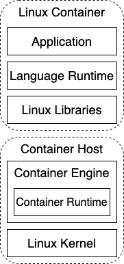

# Application Runtime Image

You are practicing Container DevOps and building many container images using a [Container Build Pipeline](docker-build-pipeline.md).  You want to build an image for your application that is as small as possible, that will occupy a minimal amount of memory and also allow for fast startup.  However you also don't want to spend a lot of time and effort in constructing your image if at all possible.

**How do you take best advantage of the layered approach of containers yet not end up with enormous images?**

Containers derive a great part of their power from the layered approach of a container image. You can build new images from existing container images and thus leverage the work done by others. Images inherit from each other, which makes it possible to have all "Ubuntu" applications run from a standardized image, all "Java" applications run from an image derived from that standard, and only the application binary distribution is the final layer that makes the container run the resulting application-specific image.

The benefits of layering in this way are many:

* Basic layers only need to be vetted once for each version
* As a cloud server will locally cache layers (subject to disk usage policies), the basic layers for your applications are likely already on the machine when it is launched, and only the application-specific layer needs to be fetched. This speeds up upgrades and launches of new applications.

However, there are drawbacks around this as well; a lot of the drawbacks are similar to the drawbacks of deep class hierarchies in object oriented programming:

* As an application developer, you may not always know what exactly resides in the shared base layers
* As a maintained of a base layer, you may not know all the applications that use your layer and therefore triggering upgrades (for example after a security patch) becomes challenging
* The deeper the hierarchy, the more complex management and correct patching policies become.

Therefore,

**Build images in layers by inheriting from other images but don't go overboard with very deep hierarchies; staying with around three conceptual layers - an OS base layer, a runtime layer, and an application layer are often enough.**

Containers run in a host environment. The container host consists of two conceptual layers:

1. **Linux kernel** -- The foundation between a computer's hardware and Linux processes
1. **Container engine** -- Pulls and runs containers as managed processes in the Linux kernel

Then each container running on the container host consists of three conceptual layers:

1. **Linux libraries** -- OS functionality that the container needs in addition to the kernel
1. **Language runtime** -- The binaries for a runtime environment for a language such as Java, Node.js, etc.
1. **Application** -- The custom logic that implements user functionality in a language such as Java, Node.js, etc.

This diagram illustrates all five layers:

We should note that we are explicitly referring to these as "conceptual" layers as distinct from the actual "literal" layers that comprise an [efficiently layered image](efficiently-layered-image.md).  That is because even a conceptual base layer may consist of several literal layers laid down during the build of the image. For instance, often a very early command in any Dockerfile (at least in debian-based images) is to download the latest updated package information with "RUN apt-get update".  That will create a literal layer with that new package information.  The Dockerfile will then contain other commands to install specific packages which create additional literal layers.  However, it's easiest to think of all of these together as being a single conceptual layer. 

You should note that the "three layers" rule is loose - for instance, three layers would be all you need for an application built using Spring Boot. However, there are often reasons to add additional literal layers between these layers.  For instance, if you were using an Application Server like Tomcat or OpenLiberty, you may well have four conceptual layers, each of which is represented by an image the next is built from; the OS, the JDK, the Application Server, and your Application.  

All this layering leads to the need to have a system in place that allows you to find and automatically regenerate base layers. For security, you will want to keep track of what applications are using what base layers (either through tooling in your Docker registry or by scanning your version control system). Having a system that allows you to [Visualize Image Dependencies](Visualize-Image-Dependencies.md) is helpful in this regard. You also want to clearly and extensively tag base layers so it is clear what they contain (for example: 'ubuntu-java:14.04-1.8u123' for an image that a java application can use). 

The next place to go for building an application is in determining what it takes to build an [Efficient Layered Image](Efficiently-Layered-Image.md).  What's more, even this basic approach, while a good place to start, may still lead you to want to separate your images during the build phase by applying [Multistage Image Build](multistage-image-build.md) which is an approach for minimizing the size and security attack surface of an image that has additional steps in the build process.  
