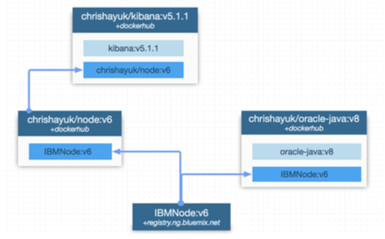

# Visualize Image Dependencies

You have a medium to large estate of container images where each image is dependent on multiple images.

The underlying layering mechanism that containers use are meaning it's difficult to see how an individual image is made up of the various base images within the estate.  In addition it's hard to see all the images that utilize the core base images.

**How can you understand the dependencies in your image model?**

* You need to understand which images in the estate are orphaned post version upgrades
* You need to understand all of the images that are affected by patching an image
* You need to understand which third party images are used or unused
* You need a simple overview of all images in the estate
* Licensing and auditing compliance

You need to develop an image dependency model.   For each container image you need to document the metadata and the dependencies of the image from the and the way in which each image depends on other images (by inheritance or by reference).

Therefore,

**Build an image dependency model as a visualization of the dependencies.**

An image dependency model will allow you to see:

* Every image in your estate
* The version of the image
* The registry that the image resides in \(and whether it's public or private\)
* All images the image is dependent on

The following diagram shows an example visualization of a dependency model.

While diagrams like this can be drawn by hand, it is best if they are provided by a tool as part of your architecture documentation.  One such open source tool is [DockViz](https://hub.docker.com/r/nate/dockviz/).  You can also see other dependencies between images by using tools like [WeaveView](https://learnk8s.io/visualise-dependencies-kubernetes).
